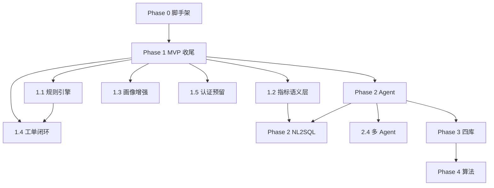

# 实施路线图（IMPLEMENTATION_ROADMAP）

> vibe coding 的分阶段任务清单。AI 每次开工前必须定位当前 Task，完成后勾选并跑测试验证。

| 项 | 内容 |
|---|---|
| 版本 | 1.1 |
| 日期 | 2026-06-03 |
| 总工期 | MVP 8 周 + 二期 16 周 + 三期 8 周（参考） |
| 关联 | `AGENTS.md`、`docs/MVP_SCOPE.md`、`docs/VIBE_CODING_PLAYBOOK.md` |

---

## 进度总览

```text
Phase 0 工程脚手架     ████████████████████ 100%  已完成
Phase 1 MVP 收尾       ████████████████████ 100%  已完成
Phase 2 Agent 增强     ████████████████████ 100%  已完成
Phase 3 四库与集成     ████████████████████  100%  里程碑门禁已通过 ← 当前
Phase 4 算法与推广     ████████████████████ 100%  已完成
项目收口（一期）       ████████████████████ 100%  闭环成立（`docs/PROJECT_CLOSURE.md`）
Phase 5 贝叶斯 L3      ████████████████████ 100%  L3-0~F 核心里程碑已完成 ← 当前
```

---

## Phase 0：工程脚手架（已完成 ✅）

**目标：** 可运行的全栈 MVP 骨架。

| Task | 内容 | 状态 | 关键文件 |
|:---:|---|:---:|---|
| 0.1 | FastAPI 项目结构 | ✅ | backend/app/ |
| 0.2 | MySQL 15 张核心表 + Alembic | ✅ | models.py, 20260602_0001 |
| 0.3 | 三类画像简化计算 | ✅ | calculator.py |
| 0.4 | 13 个核心 API | ✅ | api/v1/endpoints/ |
| 0.5 | 统一错误响应 | ✅ | core/errors.py |
| 0.6 | Vue3 前端 6 页 | ✅ | frontend/src/pages/ |
| 0.7 | Docker MySQL | ✅ | deploy/docker-compose.yml |
| 0.8 | 演示种子数据 | ✅ | seed_demo_data.py |
| 0.9 | Qwen 助手接入 | ✅ | safety_assistant.py |
| 0.10 | 设计说明书 | ✅ | 技术参考文档/ |

---

## Phase 1：MVP 收尾（当前阶段，预计 2–3 周）

**目标：** 补齐 MVP 缺口，达到试点演示验收标准。

### 1.1 规则引擎服务化

| Task | 内容 | 依赖 | 验收 |
|:---:|---|---|---|
| 1.1.1 | 创建 `config/rules/project_rules.yaml` | ✅ | YAML 含 SR-PROJ-001/004 |
| 1.1.2 | 创建 `config/rules/worker_rules.yaml` | ✅ | YAML 含 SR-WORKER-001/002/004/005 |
| 1.1.3 | 实现 `services/rules/engine.py` 读取 YAML | ✅ | 单元测试通过 |
| 1.1.4 | calculator 改为调用 rule engine | ✅ | 画像结果保持兼容 |
| 1.1.5 | 规则触发时自动写 rule_trigger_log | ✅ | 重算后日志增加 |
| 1.1.6 | 扩充到 10 条规则（配置文件） | ✅ | YAML 10 条，覆盖项目/工人/分包商 |

**涉及文件：**
- 新增：`config/rules/*.yaml`、`backend/app/services/rules/engine.py`
- 修改：`calculator.py`、`profiles/service.py`
- 测试：`tests/services/test_rule_engine.py`

---

### 1.2 指标语义层落地

| Task | 内容 | 依赖 | 验收 |
|:---:|---|---|---|
| 1.2.1 | 新增 `metric_catalog` 表 Alembic 迁移 | — | ✅ 已完成 |
| 1.2.2 | 创建 `config/metrics/catalog.yaml`（30 指标） | ✅ | 当前 32 条启用指标 |
| 1.2.3 | 种子脚本写入 metric_catalog | ✅ | YAML 幂等 upsert，当前 DB 32 条 |
| 1.2.4 | metrics API 接 DB（替换 mock） | 1.2.3 | ✅ GET /metrics/catalog 分页 |
| 1.2.5 | 前端指标目录页（可选） | 1.2.4 | ✅ `/metrics` 列表+详情 |

**涉及文件：**
- 新增：Alembic migration、`config/metrics/catalog.yaml`
- 修改：`models.py`、`services/metrics/service.py`
- 测试：`tests/services/test_metrics.py`

---

### 1.3 画像引擎增强

| Task | 内容 | 依赖 | 验收 |
|:---:|---|---|---|
| 1.3.1 | POST /profile/recalculate 支持 worker | ✅ | 返回 recalculated_workers |
| 1.3.2 | POST /profile/recalculate 支持 subcontractor | ✅ | 返回 recalculated_subcontractors |
| 1.3.3 | 画像 API 返回 calculated_at | — | ✅ 三类 GET profile 返回 `calculated_at`，保留兼容字段 `calc_date` |
| 1.3.4 | 画像 confidence_level 对外契约 | — | ✅ 三类 GET profile、Pydantic schema、前端类型已固化 |

---

### 1.4 工单闭环完善

| Task | 内容 | 依赖 | 验收 |
|:---:|---|---|---|
| 1.4.1 | 前端工单「确认」按钮 → PATCH confirm | ✅ | 状态变 dispatched |
| 1.4.2 | 前端完整流转操作（accept/submit/review） | ✅ | 可演示到 closed |
| 1.4.3 | 前端创建工单表单 | ✅ | POST /work-orders 成功 |
| 1.4.4 | 规则触发 → 去重自动创建工单 | ✅ | 重算响应含 created/skipped 计数 |
| 1.4.5 | 超期升级（API 触发，无 Cron） | ✅ | `POST /work-orders/escalate-overdue` |

**涉及文件：**
- 修改：`frontend/src/pages/WorkOrdersPage.vue`、`frontend/src/api/client.ts`
- 测试：`tests/test_work_order_flow.py`

---

### 1.5 认证预留

| Task | 内容 | 依赖 | 验收 |
|:---:|---|---|---|
| 1.5.1 | mock `get_current_user` + `/auth/me` | — | ✅ `core/security.py` |
| 1.5.2 | service 层 data_scope 过滤 | 1.5.1 | ✅ 画像/工单/dashboard/rules 已覆盖，metrics 接入 mock 用户上下文 |
| 1.5.3 | 权限测试集 10 条 | 1.5.2 | ✅ `test_auth_mock.py` + `test_data_scope.py` 合计 10 条通过 |

---

### 1.6 事故案例库（MVP 简版）

| Task | 内容 | 依赖 | 验收 |
|:---:|---|---|---|
| 1.6.1 | 新增 accident_case_library 表迁移 | — | ✅ `20260604_0002_accident_case_library.py`，本地 `alembic upgrade head` 通过 |
| 1.6.2 | 种子 5 条结构化案例 | 1.6.1 | ✅ `seed_accident_cases` 幂等同步 5 条 |
| 1.6.3 | GET /case/list API（简版） | 1.6.2 | ✅ `GET /api/v1/case/list` 返回 `SUCCESS`，默认租户 5 条 |

---

### 1.7 测试与文档

| Task | 内容 | 依赖 | 验收 |
|:---:|---|---|---|
| 1.7.1 | API smoke 覆盖核心路由 | — | ✅ 已覆盖 dashboard/work-orders/rules/profile/metrics/case 等核心路由 |
| 1.7.2 | 画像算法数据集 20 条 | — | ✅ `tests/datasets/profile_algo_20.jsonl` 已建并有测试校验 |
| 1.7.3 | 更新 openapi.yaml（可选） | — | ✅ `docs/api/openapi.yaml` 已按当前 FastAPI 路由重新生成 |
| 1.7.4 | README 补充 Phase 1 功能 | — | ✅ README 已补 Phase 1 功能、验证命令和常用接口 |

---

### Phase 1 里程碑验收

- [x] 10 条强规则可配置触发
- [x] 30 个指标可查（当前 32 条）
- [x] 三类画像均可重算
- [x] 工单前端可完整流转
- [x] 工单超期可 API 升级
- [x] 规则触发可自动去重工单
- [x] pytest 全绿 + check_db_schema
- [x] 演示：大屏 → 画像 → 规则 → 工单 → 助手

---

## Phase 2：Agent 与智能问数（预计 8 周）

**目标：** 6 Agent 编排、NL2SQL、会话记忆、Prompt 版本管理。

> ⚠️ Phase 2 任务不在 MVP 范围，Phase 1 验收通过后再启动。

### 2.1 记忆系统（MVP+）

| Task | 内容 | 前置 |
|:---:|---|---|
| 2.1.1 | Docker Compose 加 Redis | Phase 1 完成 | 可选 Redis；单测 FakeRedis |
| 2.1.2 | L1 会话记忆 session:{user}:{session_id} | Redis | ✅ |
| 2.1.3 | agent_session_summary MySQL 归档 | 2.1.2 | ✅ |
| 2.1.4 | L2 agent_task_checkpoint 表 + Redis | 2.1.2 | ✅ |
| 2.1.5 | GET/POST /memory/session API | 2.1.2 | ✅ |

### 2.2 指标语义层增强

| Task | 内容 |
|:---:|---|
| 2.2.1 | POST /metrics/validate | ✅ |
| 2.2.2 | GET /metrics/lineage/{code} | ✅ |
| 2.2.3 | GET /metrics/aliases（NL2SQL 映射） | ✅ |
| 2.2.4 | 指标扩展至 100 个 | ✅ 种子 100 条 |

### 2.3 NL2SQL

| Task | 内容 |
|:---:|---|
| 2.3.1 | agent_nl2sql_audit 表 | ✅ |
| 2.3.2 | SQL 白名单 + AST 审计 | ✅ |
| 2.3.3 | POST /agent/nl2sql | ✅ |
| 2.3.4 | 100+ 问数测试集 tests/datasets/nl2sql_100.jsonl | ✅ 105 条 |
| 2.3.5 | 歧义澄清对话流程 | ✅ |

### 2.4 多 Agent 编排

| Task | 内容 |
|:---:|---|
| 2.4.1 | prompts/ 六 Agent System Prompt | ✅ |
| 2.4.2 | agent_prompt_version 表 | ✅ |
| 2.4.3 | 主控 Agent 意图识别 + 路由 | ✅ |
| 2.4.4 | POST /agent/ask 统一入口 | ✅ |
| 2.4.5 | 并行/串行 DAG 调度 | ✅ dry/controlled + 审批 |
| 2.4.6 | agent_feedback 反馈闭环 | ✅ |

### 2.5 隐患整改 Agent

| Task | 内容 |
|:---:|---|
| 2.5.1 | 隐患整改 Prompt + 工具 | ✅ |
| 2.5.2 | 整改建议引用 evidence | ✅ |
| 2.5.3 | 建议 → 工单（需人工 confirm） | ✅ |

### Phase 2 里程碑

- [x] 问数准确率 ≥ 85% — 105-case benchmark 全通过，`audit_pass_rate=1.0`（详见 `docs/PHASE2_ACCEPTANCE.md`）
- [x] 6 Agent 可演示编排 — 六路路由 + DAG + 审批 + 前端三页可演示
- [x] 会话多轮上下文命中率 ≥ 90% — 85-case benchmark，`context_hit_rate=1.0`（`memory_context_55.jsonl`）
- [x] Prompt 版本可登记/回滚 — `GET/POST /agent/prompts*` + activate 回滚
- [x] 权限越权拦截率 100% — data_scope + company/project scope 测试全绿

---

## Phase 3：四库协同与集成（预计 8 周）

> **启动材料：** `docs/PHASE3_KICKOFF_AGENDA.md`、`docs/plans/08-phase3-four-libraries-integration.md`  
> **前置：** Phase 2 里程碑已通过（`docs/PHASE2_ACCEPTANCE.md`）

| 子阶段 | 模块 | 关键 Task | 中间件批准 |
|:---:|---|---|---|
| 3-A | 认证 | JWT 登录、RBAC、OAuth2 占位 | — |
| 3-B | Redis 缓存 | 画像/问数短缓存 | Redis（已有） |
| 3-C | Milvus RAG | ingest、retrieve、`/rag/search`、Agent evidence | **需批准 Milvus** |
| 3-D | Neo4j 图谱 | MySQL→图同步、`/graph/neighbors` | **需批准 Neo4j**（建议延后） |
| 3-E | 集成 | 周报 API、Webhook 企业微信沙箱 | — |
| 3-F | 前端 | 报告页、移动基础适配、登录页 | 依赖 3-A |

### Phase 3 里程碑（门禁草案）

- [x] RAG top-3 命中率 ≥ 80%（`rag_retrieval_30.jsonl` + `test_rag_retrieve_benchmark`）
- [x] MySQL + Redis + Milvus 本地 compose 一键健康（`check_stack_health.py` + `check_four_libraries_health.py`）
- [x] JWT 登录 + RBAC 越权拦截 100%（`test_auth_jwt*` + `test_rbac*`）
- [x] Webhook 沙箱投递 API（`POST /webhooks/test` + `webhook_delivery_log`）
- [x] 项目周报 API（`GET /reports/project-weekly/{id}`）+ 前端页 `/reports/project`（3-F.1）
- [x] 分包商评价 API（`GET /reports/subcontractor-eval/{id}`）+ 前端页 `/reports/subcontractor`（3-F.2）
- [x] 3-F 前端增强收口：规则筛选、移动适配、登录页 token 主动续期（3-F.3–3-F.5）
- [x] 3-B Redis 业务缓存：画像 600s / NL2SQL 600s / 空结果 60s / health redis
- [x] 3-D Neo4j 图谱：`/graph/neighbors` + 同步脚本 + `graph.read_neighbors`
- [x] pytest 全绿 + schema check + `npm run build`（见 `docs/PHASE3_ACCEPTANCE.md`）

---

## Phase 4：算法与推广（预计 8 周）

> **启动材料：** `docs/PHASE4_KICKOFF_AGENDA.md`、`docs/plans/09-phase4-algorithm-and-scale.md`  
> **前置：** Phase 3 里程碑已通过（`docs/PHASE3_ACCEPTANCE.md`）

| 子阶段 | 模块 | 关键 Task | 门禁 |
|:---:|---|---|---|
| 4-A | 权重与因子 | 项目类型矩阵 + DF-* + 版本回滚 | 评审批准即可开工 |
| 4-B | 案例与回测 | 案例 ≥50 + `run_case_backtest.py` | 当前 20 条 → 目标 50 |
| 4-C | 性能压测 | 100/500/2000 项目合成灌数 + P95 报告 | 独立压测环境 |
| 4-D | 贝叶斯 L2 | 专家先验 + 归因 API（可选） | 案例 ≥50 + 表决 |
| 4-E | behavior_memory | 培训摘要（可选） | **合规签字** |
| 4-F | 视频 / BIM | 事件占位（可选） | 边缘/BIM 源 |
| 4-G | 灾备 | RTO/RPO 目标文档 | 准生产 |

### Phase 4 里程碑（门禁草案）

- [x] 项目类型权重四类可切换且可回滚（4-A）
- [x] 案例库 ≥50 条（4-B.1，`AC-MVP-001` … `050`）
- [x] 案例回测报告可生成（4-B.3–4-B.5）
- [x] 500 项目压测 P95 达标（4-C.4，`docs/perf/baseline_500.md`）
- [x] 2000 项目目标压测报告（4-C.5，`docs/perf/baseline_2000.md`）
- [x] profile/recalculate 批量耗时 + 连接池调优（4-C.6，`docs/perf/profile_recalculate_benchmark.md`）
- [x] pytest 全绿 + schema + `npm run build`（397 passed，见 `docs/PHASE4_ACCEPTANCE.md`）
- [x] 贝叶斯 L2 可演示（4-D，`POST /api/v1/analysis/attribution`）

---

## 任务执行模板

每个 Task 执行时 AI 应遵循：

```markdown
### 执行 Task X.Y.Z：[名称]

**目标：** [一句话]
**范围：** In Scope — 见 MVP_SCOPE.md [章节]
**不在范围：** [明确不做什么]

**步骤：**
1. [ ] 读相关文件：...
2. [ ] 写失败测试
3. [ ] 实现
4. [ ] pytest -v
5. [ ] 更新本文件勾选

**验收：** [具体可验证条件]
```

---

## 依赖关系图



---

## 文件清单（随 Phase 1 应创建）

| 文件 | Phase | 用途 |
|---|---|:---:|
| `config/rules/project_rules.yaml` | 1 | 项目强规则 |
| `config/rules/subcontractor_rules.yaml` | 1 | 分包商强规则 |
| `config/rules/worker_rules.yaml` | 1 | 工人强规则 |
| `config/metrics/catalog.yaml` | 1 | 30 核心指标 |
| `backend/tests/services/test_rule_engine.py` | 1 | 规则引擎测试 |
| `backend/tests/datasets/profile_algo_20.jsonl` | 1 | 画像算法用例 |
| `docs/VIBE_CODING_PLAYBOOK.md` | 1+ | 分阶段执行手册、Sprint 顺序 |
| `docs/plans/01-metric-semantic.md` | 1 | 30 指标 |
| `docs/plans/02-rule-engine-expand.md` | 1 | 10 条规则 |
| `docs/plans/03-profile-api.md` | 1 | API 契约 |
| `docs/plans/04-work-order-overdue.md` | 1 | 超期升级 |
| `docs/plans/05-auth-scope.md` | 1 | 权限补全 |
| `docs/plans/06-accident-case.md` | 1 | 案例库 |
| `docs/plans/07-phase2-agent-memory.md` | 2 | Agent/记忆概要 |
| `docs/plans/08-phase3-four-libraries-integration.md` | 3 | 四库/RAG/认证/集成 |
| `docs/PHASE3_KICKOFF_AGENDA.md` | 3 | 启动评审议程 |
| `docs/plans/09-phase4-algorithm-and-scale.md` | 4 | 权重/回测/压测/贝叶斯 |
| `docs/PHASE4_KICKOFF_AGENDA.md` | 4 | 启动评审议程 |
| `prompts/` | 2 | Agent Prompt |
| `deploy/docker-compose.yml` | 2–3 | Redis；Phase 3 扩展 Milvus |

---

## Phase 1 剩余任务排期（vibe coding 执行顺序）

| Sprint | Task 列表 | 计划文件 | 预估 |
|:---:|---|---|:---:|
| **A** | 1.2.2 → 1.2.3 | `docs/plans/01-metric-semantic.md` | ✅ 已完成 |
| **B** | 1.1.6 | `docs/plans/02-rule-engine-expand.md` | ✅ 已完成 |
| **C** | 1.3.3、1.3.4、1.4.5、1.5.2、1.5.3 | `03`–`05` plans | ✅ 已完成 |
| **D** | 1.6.1 → 1.6.3 | `docs/plans/06-accident-case.md` | ✅ 已完成 |
| **E** | 1.7.x、1.2.5（可选） | `VIBE_CODING_PLAYBOOK.md` §6 | ✅ 已完成（1.2.5 为非门禁可选项） |

---

## 当前推荐下一个 Task

**建议开始：Phase 4 启动评审 — 算法增强与规模验证**

理由：
- Phase 3 六项里程碑已通过（`docs/PHASE3_ACCEPTANCE.md`）；
- Phase 4 含贝叶斯/压测/behavior_memory，需数据量与合规表决后再编码；
- 推荐首 Sprint：**4-A 权重矩阵** + **4-B 案例扩充至 ≥50**（无外部中间件依赖）。

**评审入口：** `docs/PHASE4_KICKOFF_AGENDA.md`  
**实施计划：** `docs/plans/09-phase4-algorithm-and-scale.md`  
**项目状态（最终）：** **已收口** — 见 `docs/PROJECT_CLOSURE.md`。Phase 0–4 全部完成；贝叶斯 L3、behavior_memory、视频/BIM、灾备实操等延后项**本期不再实施**。

---

**文档结束**

## Phase 2 Current Status (2026-06-04)

- [x] 2.1 Memory system MVP+: Redis session memory, MySQL summary archive, checkpoint table, `GET/POST /api/v1/memory/session`.
- [x] 2.2 Metric semantic layer enhancement: `POST /metrics/validate`, `GET /metrics/lineage/{code}`, `GET /metrics/aliases`, `metric_catalog.aliases`, 100 seeded metrics.
- [ ] 2.3 NL2SQL: not started.
- [ ] 2.4 Six-Agent orchestration: not started.
- [x] 2.5 Hazard rectification Agent: hazard evidence bundle, evidence-backed suggestions, DAG draft step, `work_orders.create` approval + execution, and `/agent/hazard-advisor` frontend page.

## Phase 2 Current Status Update (2026-06-04 / 2.3-A)

- [x] 2.1 Memory system MVP+: Redis session memory, MySQL summary archive, checkpoint table, `GET/POST /api/v1/memory/session`.
- [x] 2.2 Metric semantic layer enhancement: `POST /metrics/validate`, `GET /metrics/lineage/{code}`, `GET /metrics/aliases`, `metric_catalog.aliases`, 100 seeded metrics.
- [x] 2.3-A NL2SQL safety gate: `agent_nl2sql_audit`, SQL AST audit service, table/field whitelist, tenant/data_scope injection, 30 audit cases.
- [ ] 2.3-B NL2SQL read-only executor: not started.
- [ ] 2.3-C LLM NL2SQL candidate generation: not started.
- [ ] 2.3-D 100+ NL2SQL benchmark: not started.
- [ ] 2.4 Six-Agent orchestration: not started.
- [x] 2.5 Hazard rectification Agent: hazard evidence bundle, evidence-backed suggestions, DAG draft step, `work_orders.create` approval + execution, and `/agent/hazard-advisor` frontend page.

## Phase 2 Current Status Update (2026-06-04 / 2.3-B)

- [x] 2.1 Memory system MVP+: Redis session memory, MySQL summary archive, checkpoint table, `GET/POST /api/v1/memory/session`.
- [x] 2.2 Metric semantic layer enhancement: `POST /metrics/validate`, `GET /metrics/lineage/{code}`, `GET /metrics/aliases`, `metric_catalog.aliases`, 100 seeded metrics.
- [x] 2.3-A NL2SQL safety gate: `agent_nl2sql_audit`, SQL AST audit service, table/field whitelist, tenant/data_scope injection, 30 audit cases.
- [x] 2.3-B NL2SQL read-only executor: executes only audited `sanitized_sql`, caps rows/fields/text, writes execution status back to `agent_nl2sql_audit`.
- [ ] 2.3-C LLM NL2SQL candidate generation: not started.
- [ ] 2.3-D 100+ NL2SQL benchmark: not started.
- [ ] 2.4 Six-Agent orchestration: not started.
- [x] 2.5 Hazard rectification Agent: hazard evidence bundle, evidence-backed suggestions, DAG draft step, `work_orders.create` approval + execution, and `/agent/hazard-advisor` frontend page.

## Phase 2 Current Status Update (2026-06-04 / 2.3-C-A-B)

- [x] 2.1 Memory system MVP+: Redis session memory, MySQL summary archive, checkpoint table, `GET/POST /api/v1/memory/session`.
- [x] 2.2 Metric semantic layer enhancement: `POST /metrics/validate`, `GET /metrics/lineage/{code}`, `GET /metrics/aliases`, `metric_catalog.aliases`, 100 seeded metrics.
- [x] 2.3-A NL2SQL safety gate: `agent_nl2sql_audit`, SQL AST audit service, table/field whitelist, tenant/data_scope injection, 30 audit cases.
- [x] 2.3-B NL2SQL read-only executor: executes only audited `sanitized_sql`, caps rows/fields/text, writes execution status back to `agent_nl2sql_audit`.
- [x] 2.3-C-A/B NL2SQL candidate generation foundation: schema context builder, strict prompt builder, mock candidate generator, mandatory audit handoff, 12 generation cases.
- [ ] 2.3-C-C Qwen candidate generation integration: not started.
- [ ] 2.3-D 100+ NL2SQL benchmark: not started.
- [ ] 2.4 Six-Agent orchestration: not started.
- [x] 2.5 Hazard rectification Agent: hazard evidence bundle, evidence-backed suggestions, DAG draft step, `work_orders.create` approval + execution, and `/agent/hazard-advisor` frontend page.

## Phase 2 Current Status Update (2026-06-04 / 2.3-C-C)

- [x] 2.1 Memory system MVP+: Redis session memory, MySQL summary archive, checkpoint table, `GET/POST /api/v1/memory/session`.
- [x] 2.2 Metric semantic layer enhancement: `POST /metrics/validate`, `GET /metrics/lineage/{code}`, `GET /metrics/aliases`, `metric_catalog.aliases`, 100 seeded metrics.
- [x] 2.3-A NL2SQL safety gate: `agent_nl2sql_audit`, SQL AST audit service, table/field whitelist, tenant/data_scope injection, 30 audit cases.
- [x] 2.3-B NL2SQL read-only executor: executes only audited `sanitized_sql`, caps rows/fields/text, writes execution status back to `agent_nl2sql_audit`.
- [x] 2.3-C-A/B NL2SQL candidate generation foundation: schema context builder, strict prompt builder, mock candidate generator, mandatory audit handoff, 12 generation cases.
- [x] 2.3-C-C Qwen provider integration: internal provider, disabled fallback, provider factory, timeout setting, API-key-missing fallback, mandatory audit handoff.
- [ ] 2.3-D 100+ NL2SQL benchmark: not started.
- [ ] 2.4 Six-Agent orchestration: not started.
- [x] 2.5 Hazard rectification Agent: hazard evidence bundle, evidence-backed suggestions, DAG draft step, `work_orders.create` approval + execution, and `/agent/hazard-advisor` frontend page.

## Phase 2 Current Status Update (2026-06-04 / 2.3-D)

- [x] 2.1 Memory system MVP+: Redis session memory, MySQL summary archive, checkpoint table, `GET/POST /api/v1/memory/session`.
- [x] 2.2 Metric semantic layer enhancement: `POST /metrics/validate`, `GET /metrics/lineage/{code}`, `GET /metrics/aliases`, `metric_catalog.aliases`, 100 seeded metrics.
- [x] 2.3-A NL2SQL safety gate: `agent_nl2sql_audit`, SQL AST audit service, table/field whitelist, tenant/data_scope injection, 30 audit cases.
- [x] 2.3-B NL2SQL read-only executor: executes only audited `sanitized_sql`, caps rows/fields/text, writes execution status back to `agent_nl2sql_audit`.
- [x] 2.3-C-A/B NL2SQL candidate generation foundation: schema context builder, strict prompt builder, mock candidate generator, mandatory audit handoff, 12 generation cases.
- [x] 2.3-C-C Qwen provider integration: internal provider, disabled fallback, provider factory, timeout setting, API-key-missing fallback, mandatory audit handoff, real Qwen smoke verified manually.
- [x] 2.3-D 100+ NL2SQL benchmark: 105-case JSONL dataset, benchmark runner, accuracy and safety-block metrics, no SQL execution and no API exposure.
- [ ] 2.4 Six-Agent orchestration: not started.
- [x] 2.5 Hazard rectification Agent: hazard evidence bundle, evidence-backed suggestions, DAG draft step, `work_orders.create` approval + execution, and `/agent/hazard-advisor` frontend page.

## Phase 2 Current Status Update (2026-06-05 / 2.3-E API Gate)

- [x] 2.3-E NL2SQL API gate decision locked: `/api/v1/agent/nl2sql` is open only through provider generation, mandatory audit logging, scope injection, and optional read-only execution.
- [x] Default execution is audit-only (`execute=false`); SQL execution requires explicit `execute=true` and still re-audits through `execute_readonly_sql`.
- [x] Default provider can remain `disabled`; local/test/development mock provider is available for demos, while mock override is blocked outside local-like environments.
- [x] Every request writes `agent_nl2sql_audit`, including generation failures and audit rejections.
- [x] API gate verification: `tests/api/test_nl2sql_api_gate.py` covers disabled provider, local mock audit-only, local mock execution, unsafe rejection, and production mock blocking.
- [ ] 2.4 Six-Agent orchestration: not started.
- [x] 2.5 Hazard rectification Agent: hazard evidence bundle, evidence-backed suggestions, DAG draft step, `work_orders.create` approval + execution, and `/agent/hazard-advisor` frontend page.

## Phase 2 Current Status Update (2026-06-05 / 2.4-A Agent Skeleton)

- [x] 2.4-A Agent prompt/version skeleton: six prompt files under `prompts/agents/`, `agent_prompt_version` model and migration, prompt hash sync, and seed integration.
- [x] `POST /api/v1/agent/ask` route preview is available with `execution_mode=route_only`; it selects a target agent and prompt version but does not run DAG orchestration or downstream tools.
- [x] Human-review boundary enforced for stop-work, penalty, removal, restricted-work, and disciplinary language.
- [x] Targeted tests cover prompt registration, all six route targets, restricted-action review, and API response shape.
- [x] 2.4-B Prompt-backed main controller preview: `/agent/ask` supports `execution_mode=execute_preview`, loads active prompt text, calls Qwen for structured route explanation, and preserves deterministic route/human-review boundaries.
- [ ] 2.4-C Multi-Agent DAG orchestration: not started.
- [x] 2.5 Hazard rectification Agent: hazard evidence bundle, evidence-backed suggestions, DAG draft step, `work_orders.create` approval + execution, and `/agent/hazard-advisor` frontend page.

## Phase 2 Current Status Update (2026-06-05 / 2.4-B Main Controller Preview)

- [x] `route_only` remains the default `/agent/ask` mode.
- [x] `execute_preview` adds advisory LLM output with `preview_status`, `llm_available`, `llm_message`, and `llm_preview`.
- [x] Qwen unavailable degrades safely to `preview_status=llm_unavailable`.
- [x] Invalid LLM output is not treated as structured route preview.
- [x] LLM output cannot change deterministic `target_agent` or downgrade `need_human_review`.
- [x] 2.4-C Multi-Agent DAG orchestration design review: `/agent/ask` supports `execution_mode=plan_only`, returning auditable `planned_steps`, `dag_status=planned`, and `dag_execution_allowed=false`.
- [x] 2.4-C explicitly remains plan-only: no DAG node execution, no parallel Agent calls, no tool execution, no SQL execution, and no automatic work-order creation.
- [x] 2.5 Hazard rectification Agent: hazard evidence bundle, evidence-backed suggestions, DAG draft step, `work_orders.create` approval + execution, and `/agent/hazard-advisor` frontend page.

## Phase 2 Current Status Update (2026-06-05 / Company-Project Scope)

- [x] Company-project scope plan added: `docs/plans/14-phase2-company-project-scope.md`.
- [x] 14-A compatibility layer started: `ScopeType.COMPANY/PROJECT`, `MockUser.company_id`, `MockUser.scope_type`, `authorized_project_ids`.
- [x] Legacy compatibility retained: `tenant_id`, `org_path`, and `DataScope.TENANT/ORG` still work.
- [x] Backend scope filtering now prefers company/project scope when project ids are available, with org_path fallback.
- [x] NL2SQL audit can inject authorized `project_id IN (...)` for project-scope users and rejects unauthorized `project_id` override.
- [x] 14-B physical `company_id` database migration: `20260605_0007_company_project_scope.py`, backfilled `company_id = tenant_id`, added company/project indexes, and kept `metric_catalog.project_id` nullable for company-level configuration.
- [x] 14-D NL2SQL company/project scope conversion: whitelist includes `company_id`, audit injection prefers `company_id/project_id`, prompt hides scope fields, 105-case benchmark expectations use `company_id`, and `/agent/nl2sql` remains closed.
- [x] 14-E-A frontend auth context and scope-aware shell: `/auth/me`, `CurrentUser`, nav filtering, project switcher state, and dashboard wording.
- [x] 14-E-B full frontend company/project view split: `GET /projects`, scope context composable, dashboard route split (`/dashboard/company` | `/dashboard/project`), interactive project switcher, nav permission matrix, and project-filtered list pages.

## Phase 2 Current Status Update (2026-06-05 / Company-Project Scope 14-B Verification)

- [x] Schema contract tests added for company/project table classification.
- [x] `alembic upgrade head`: upgraded through `20260605_0007_company_project_scope.py`.
- [x] `python scripts/check_db_schema.py`: 18 ORM tables match the database.
- [x] Targeted backend verification: 33 passed.
- [x] Full backend verification: `pytest -q` -> 100 passed.

## Phase 2 Current Status Update (2026-06-05 / Company-Project Scope 14-D Verification)

- [x] NL2SQL audit scope injection migrated from `tenant_id/org_path` primary injection to `company_id/project_id`.
- [x] Project-scope users receive `project_id IN (...)`; metric configuration keeps company defaults visible through `project_id IS NULL OR project_id IN (...)`.
- [x] Schema context and prompt keep `company_id`, `tenant_id`, and `org_path` out of LLM-visible fields.
- [x] `nl2sql_100.jsonl` expected SQL fragments no longer depend on `tenant_id/org_path`.
- [x] Targeted NL2SQL verification: 31 passed.
- [x] Full backend verification: `pytest -q` -> 102 passed.

## Phase 2 Current Status Update (2026-06-05 / Company-Project Scope 14-E-A)

- [x] Frontend plan added: `docs/plans/15-phase2-frontend-company-project-view.md`.
- [x] `api.me()` added for `/api/v1/auth/me`.
- [x] Scope helpers added for nav filtering, topbar copy, project switcher state, and dashboard wording.
- [x] `App.vue` now loads current mock user context and renders a scope-limited project switcher.
- [x] `DashboardPage.vue` switches company/project titles and ranking copy based on `scope_type`.
- [x] Frontend pure scope assertions passed.
- [x] `npm run build` passed.
- [x] Backend auth smoke: 1 passed.

## Work Order Workflow Extension Status (2026-06-05 / Hazard Upload Foundation)

- [x] Work order refactor plan accepted: `docs/plans/工单改造参考文档.md`.
- [x] Task 1 data model foundation: `ProjectUser`, `WorkOrderFlowLog`, and hazard workflow fields.
- [x] Task 2 role/action matrix: `backend/app/domain/hazard_workflow.py`.
- [x] Task 3 permission foundation: `MockUser.subcontractor_id`, `X-Subcontractor-Id`, and DB-backed project role checks.
- [x] Alembic migration applied through `20260605_0008_hazard_workflow_foundation.py`.
- [x] Schema check: 20 ORM tables match the database.
- [x] Full backend verification: `pytest -q` -> 109 passed.
- [x] Task 4 local file storage: `save_image`, JPEG/PNG validation, size limit, sha256 metadata, and uploads gitignore.
- [x] Task 5 hazard upload service layer: `create_hazard_with_work_order` creates `hazard + safety_work_order + flow_log(create)` in one transaction.
- [x] Full backend verification after Task 4–5: `pytest -q` -> 113 passed.
- [x] Task 6 work order workflow service: `transition_work_order` supports confirm, accept, submit_result, review_pass, and review_reject with DB-backed project role checks, flow logs, rectification attachment validation, hazard close, and project profile recalculation.
- [x] Task 7 hazard/work-order/files API endpoints: `POST /projects/{project_id}/hazards`, scoped `GET /files/{file_id}`, `GET /work-orders/{id}` detail, and workflow-backed `PATCH /work-orders/{id}/status` are implemented.
- [x] Task 8 seed demo workflow data: `seed_demo_data.py` now idempotently syncs P002 role accounts, demo hazard `H-DEMO-P002-001`, demo work order `WO-DEMO-P002-001`, and initial flow log for local curl demos.
- [x] Acceptance/demo closure: `backend/scripts/verify_hazard_workflow_demo.py` runs the upload -> confirm -> accept -> submit_result -> review_pass route through API endpoints and verifies `work_order.status=closed`, `hazard.status=closed`, and `work_order_flow_log >= 5`.

## Phase 2 Current Status Update (2026-06-06 / 2.4-D Controlled DAG Executor)

- [x] 2.4-D controlled DAG executor v1 is implemented.
- [x] `/api/v1/agent/ask` supports `execution_mode=dry_run`.
- [x] `/api/v1/agent/ask` supports `execution_mode=controlled_execute`.
- [x] Added `agent_dag_run` and `agent_dag_step_run` audit tables through Alembic migration `20260606_0010_agent_dag_run.py`.
- [x] Added Agent tool registry with read-only, write-side, and restricted tool classifications.
- [x] `dry_run` validates planned steps and persists audit records without executing tools.
- [x] `controlled_execute` executes only read-only tools; write-side tools return `approval_required`, restricted tools return `blocked`.
- [x] Work-order inspection can run through read-only tool `work_orders.read`.
- [x] No automatic work-order creation, dispatch, transition, closure, penalty, stop-work, or subcontractor removal is performed.
- [x] Verification: targeted Agent DAG/API tests passed, Alembic upgrade reached head, and schema check passed with 23 ORM tables.
- [ ] 2.4-E broader tool coverage review: not started.
- [x] 2.5 Hazard rectification Agent: hazard evidence bundle, evidence-backed suggestions, DAG draft step, `work_orders.create` approval + execution, and `/agent/hazard-advisor` frontend page.

## Phase 2 Current Status Update (2026-06-06 / 2.4-E Read-Only Tool Coverage)

- [x] 2.4-E broader read-only tool coverage is implemented.
- [x] `controlled_execute` now supports `profile.read` summary execution.
- [x] `controlled_execute` now supports `rules.read_triggers` summary execution.
- [x] `controlled_execute` now supports `hazards.read` summary execution.
- [x] `controlled_execute` now supports `metrics.read_catalog` summary execution.
- [x] DAG planner maps risk profile, rule compliance, hazard rectification, and metric/NL2SQL branches to explicit read-only tools.
- [x] Read-only tool outputs are bounded summaries with explicit field allowlists.
- [x] No binary file content, local file paths, large evidence JSON, or sensitive identity/health/media fields are returned.
- [x] Write-side tools remain blocked or `approval_required`; no automatic business disposition is enabled.
- [x] Verification: targeted Agent read-tool/API tests passed.
- [ ] 2.4-F further tool coverage / approval workflow review: not started.
- [x] 2.5 Hazard rectification Agent: hazard evidence bundle, evidence-backed suggestions, DAG draft step, `work_orders.create` approval + execution, and `/agent/hazard-advisor` frontend page.

## Phase 2 Current Status Update (2026-06-07 / 2.4-F-A Agent Approval Queue)

- [x] 2.4-F-A design added: `docs/plans/22-phase2-agent-approval-workflow.md`.
- [x] Added `agent_approval_request` through Alembic migration `20260607_0011_agent_approval_request.py`.
- [x] Added approval queue service for pending/list/detail/approve/reject state changes.
- [x] Added `/api/v1/agent/approvals` list/detail/approve/reject APIs.
- [x] `controlled_execute` write-side tools now persist `approval_required + approval_id`.
- [x] `/api/v1/agent/ask` can generate an approval request for explicit work-order transition requests with `context.work_order_id`.
- [x] Approval state changes do not call work-order or hazard write services.
- [x] Restricted tools remain `blocked` and do not enter the approval queue.
- [x] Alembic upgrade reached head and schema check passed with 24 ORM tables.
- [x] Verification: targeted Agent approval tests passed; full backend `pytest -q --basetemp .pytest_tmp` passed with 180 tests.
- [ ] 2.4-G human-approved execution review: not started.
- [x] 2.5 Hazard rectification Agent: hazard evidence bundle, evidence-backed suggestions, DAG draft step, `work_orders.create` approval + execution, and `/agent/hazard-advisor` frontend page.

## Phase 2 Current Status Update (2026-06-07 / 2.4-G Human-Approved Execution)

- [x] 2.4-G design added: `docs/plans/23-phase2-agent-human-approved-execution.md`.
- [x] Added approval execution audit fields through Alembic migration `20260607_0012_agent_approval_execution.py`.
- [x] Added `execute_approved_request()` for human-triggered execution of approved `work_orders.transition` requests.
- [x] Added `POST /api/v1/agent/approvals/{approval_id}/execute`.
- [x] Execution uses the current human user and re-checks existing work-order workflow permissions.
- [x] Execution success writes `status=executed`, `executor_user_id`, `executed_at`, and `execution_result`.
- [x] Execution failure writes `status=execution_failed` and `execution_error`.
- [x] Agent `controlled_execute` still only creates approval requests and does not auto-execute work orders.
- [x] Restricted tools and non-`work_orders.transition` tools remain non-executable in 2.4-G.
- [x] Alembic upgrade reached head and schema check passed with 24 ORM tables.
- [x] Verification: targeted Agent approval execution tests passed.
- [x] 2.4-H approval execution frontend: `/agent/approvals` 页面，列表/详情/批准/驳回/执行 + 演示生成审批单。
- [x] 2.5 Hazard rectification Agent: hazard evidence bundle, evidence-backed suggestions, DAG draft step, `work_orders.create` approval + execution, and `/agent/hazard-advisor` frontend page.

## Phase 2 Current Status Update (2026-06-07 / 2.4-H Frontend)

- [x] `frontend/src/pages/AgentApprovalsPage.vue` 对接 `/api/v1/agent/approvals*` 与 `POST /agent/ask` 演示生成。
- [x] `api.client.ts` 增加 `agentApprovals` / `approve` / `reject` / `execute` / `agentAsk`。
- [x] 侧栏新增「Agent 审批」入口 `/agent/approvals`。
- [x] `npm run build` 通过。

## Phase 2 Current Status Update (2026-06-07 / 2.3.5 NL2SQL Clarification)

- [x] Added `services/nl2sql/clarification.py` with `agent_task_checkpoint`-backed clarification sessions.
- [x] Extended `POST /api/v1/agent/nl2sql` with `clarification_id` + `clarification_reply` follow-up contract.
- [x] Clarification responses include `clarification_prompt`, `awaiting_clarification`, `turn`, and `refined_question`.
- [x] Prompt/generator now inject clarification context on follow-up turns.
- [x] Added tests: `test_nl2sql_clarification.py` and API gate multi-turn cases.
- [x] Frontend `/agent/nl2sql` multi-turn chat page for company users.
- [x] `npm run build` 通过。

## Phase 2 Current Status Update (2026-06-08 / 2.4.6 Agent Feedback)

- [x] Added `agent_feedback` ORM model and migration `20260608_0013_agent_feedback.py`.
- [x] Added `POST /api/v1/agent/feedback` and `GET /api/v1/agent/feedback` with company/project scope filtering.
- [x] Supported feedback types: `thumb`, `rating`, `correction`, `adoption`; entries default to `label_status=pending`.
- [x] Feedback is stored for offline labeling and prompt tuning only; no automatic rule or prompt changes.
- [x] Added reusable `AgentFeedbackBar` on hazard advisor, NL2SQL chat, and agent approvals pages.
- [x] Added tests: `test_agent_feedback.py`, `test_agent_feedback_api.py`, smoke route check.
- [x] `npm run build` 通过。

## Phase 2 Milestone Acceptance (2026-06-03)

- [x] Ran Phase 2 gate pytest subset: **85 passed** (Python 3.12).
- [x] NL2SQL benchmark: 105/105 cases, `audit_pass_rate=1.0`, `generation_valid_rate=0.8667`.
- [x] Six-Agent routing, DAG execution, hazard rectification approval flow, NL2SQL clarification, agent feedback, memory API — all covered by automated tests.
- [x] Acceptance report: `docs/PHASE2_ACCEPTANCE.md`.
- [x] Memory context hit-rate benchmark: 85 cases in `tests/datasets/memory_context_55.jsonl`, `context_hit_rate=1.0`.
- [x] Phase 2 closure: Prompt rollback API (`/agent/prompts*`), Docker Compose Redis, `session_id` memory bridge on `/agent/ask` + `/agent/nl2sql`.

## Phase 3 Current Status Update (2026-06-09 / 3-A.1 RBAC Schema)

- [x] 3-A.1 RBAC foundation tables: `user_account`, `auth_role`, `user_role` ORM + Alembic `20260609_0014_user_rbac_foundation.py`.
- [x] Permission bundles in `app/domain/rbac.py` (`platform_admin`, `company_analyst`, `project_safety_officer`).
- [x] Idempotent `seed_rbac_foundation()` wired into `seed_demo_data.py` (mock-admin, U-DIR-01, U-PM-P001, U-CO-ANALYST).
- [x] Tests: `test_rbac_schema.py`, `test_rbac_seed.py` (8 passed).
- [x] 3-A.2 JWT login API: `POST /auth/login`, `POST /auth/refresh`, bcrypt 密码校验，演示密码 `demo_default_password`。
- [x] 3-A.3 `get_current_user` Bearer + `AUTH_MODE=mock|jwt` + `auth_allow_mock_headers` 开发开关。
- [x] Tests: `test_auth_jwt_api.py`, `test_auth_jwt_tokens.py`（10 passed with mock 兼容）。
- [x] 3-A.5 前端登录页：`/login`、`localStorage` token、Axios Bearer/refresh 拦截器、`VITE_AUTH_MODE=jwt|mock`。
- [x] 3-A.4 RBAC endpoint 守卫：`core/rbac.py` + 核心 API `require_permissions` + 前端导航按 permissions 过滤。
- [x] 3-A.6 OAuth2 占位：`GET /auth/oauth/authorize`、`GET /auth/oauth/callback`（mock 发 token / live 501）。

---

## Phase 5：贝叶斯 L3（重新立项，2026-06-08）

**分支：** `feature/phase5-bayesian-l3`  
**评审：** `docs/PHASE5_BAYESIAN_L3_KICKOFF.md`  
**Task 清单：** `docs/plans/10-bayesian-l3-implementation.md`

### Sprint 1 — L3-0 / L3-A / L3-B

| Task | 内容 | 状态 | 关键文件 |
|:---:|---|:---:|---|
| L3-0.1 | 案例量门禁脚本（≥200） | ✅ | `scripts/check_bayesian_l3_gate.py` |
| L3-0.2 | 案例覆盖度报告 | ✅ | `scripts/report_case_coverage.py` |
| L3-0.3 | 专项评审纪要 | ✅ | `docs/PHASE5_BAYESIAN_L3_KICKOFF.md` |
| L3-A.1 | DAG 结构 YAML | ✅ | `config/bayesian/network_structure.yaml` |
| L3-A.2 | 结构加载与环检测 | ✅ | `domain/bayesian/structure.py` |
| L3-A.3 | CPT 槽位定义 | ✅ | `domain/bayesian/cpt.py` |
| L3-A.4 | 冷启动 CPT JSON | ✅ | `config/bayesian/cpt_prior.json` |
| L3-B.1–B.4 | 案例标签 + 训练行 | ✅ | `case_labels.py`、`dataset.py` |
| L3-B.5 | 黄金集 50 条 | ✅ | `tests/datasets/bayesian_l3_train_50.jsonl` |
| L3-B.6 | 种子扩至 200+ | ✅ | `seed_cases_l3_bulk.py` |

### Sprint 2 — L3-C

| Task | 内容 | 状态 | 关键文件 |
|:---:|---|:---:|---|
| L3-C.1 | Laplace MLE CPT 训练 | ✅ | `services/bayesian/training.py` |
| L3-C.2 | 训练 CLI | ✅ | `scripts/train_bayesian_l3.py` |
| L3-C.3 | 模型版本 metadata | ✅ | `config/bayesian/cpt_learned.json` |
| L3-C.4 | 校准指标 | ✅ | `services/bayesian/calibration.py` |
| L3-C.5 | 校准 CLI + 报告 | ✅ | `scripts/run_bayesian_l3_backtest.py` |

### Sprint 3 — L3-D / L3-E / L3-F

| Task | 内容 | 状态 | 关键文件 |
|:---:|---|:---:|---|
| L3-D.1–D.4 | L3 推理 + 传播路径 + L2 回退 | ✅ | `l3_inference.py`、`service.py` |
| L3-E.1–E.5 | `model_level` API + bayesian-versions | ✅ | `schemas/bayesian.py`、`endpoints/config.py` |
| L3-F.1–F.5 | 集成测试 + 验收报告 | ✅ | `test_bayesian_l3.py`、`PHASE5_BAYESIAN_L3_ACCEPTANCE.md` |
