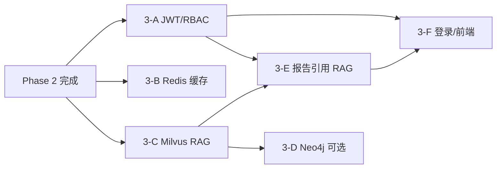

# 08 Phase 3 四库协同与集成计划

| 项 | 内容 |
|---|---|
| 版本 | 1.0 |
| 日期 | 2026-06-03 |
| 前置 | Phase 2 里程碑已通过（`docs/PHASE2_ACCEPTANCE.md`） |
| 关联 | `docs/IMPLEMENTATION_ROADMAP.md` §219、`docs/MVP_SCOPE.md` §2、`AGENTS.md` |

---

## 1. 启动结论（评审待签）

**推荐默认路线（可调整）：**

```text
3-A 认证与 RBAC  →  3-C Milvus RAG  →  3-E Webhook/报告  →  3-B Redis 缓存增强  →  3-D Neo4j  →  3-F 前端
```

| 决策项 | 推荐默认 | 评审需确认 |
|---|---|---|
| 首个 Sprint | **3-C RAG MVP** 或 **3-A JWT** | 试点演示优先 RAG；对外试点优先认证 |
| Milvus | Docker 单机 `milvus-standalone` | 是否批准引入；embedding 用 DashScope text-embedding 或本地 |
| Neo4j | **延后** 至案例 ≥30 且关系查询有明确场景 | 是否批准；同步策略（全量/增量） |
| OAuth2 | 先 **JWT + mock IdP**，再接集团 OAuth2 | IdP 对接时间表 |
| Webhook | 企业微信机器人 **沙箱 URL** | 生产推送审批流程 |
| 工期 | 8 周（可分 6 个子阶段） | 每子阶段 1.5–2 周 |

**门禁（开工前）：**

- [x] Phase 2 五项里程碑验收通过
- [ ] 本计划评审签字（产品 + 技术）
- [ ] 用户明确批准引入 **Milvus**（3-C 开工必备）
- [ ] 用户明确批准引入 **Neo4j**（仅 3-D 开工时需要）
- [ ] RAG 语料最低入库量确认（建议 ≥20 条结构化案例 + ≥10 条制度片段）

---

## 2. 子阶段总览

| 子阶段 | 目标 | 关键中间件 | 预估 |
|:---:|---|---|:---:|
| **3-A** | 替换 mock 认证，JWT + RBAC + data_scope 注入 | 无（PyJWT） | 2 周 |
| **3-B** | Redis 画像/问数短缓存，降低重复计算 | Redis（已有） | 1 周 |
| **3-C** | 事故案例 + 安全知识 RAG，接入 Agent 证据链 | **Milvus** | 2 周 |
| **3-D** | 项目-分包-工人-隐患关系图谱查询 | **Neo4j** | 2 周 |
| **3-E** | 周报 API、Webhook 推送、OA 占位 | HTTP Webhook | 1.5 周 |
| **3-F** | 报告页、规则日志增强、移动端基础适配 | 无 | 1.5 周 |

---

## 3. 3-A 认证与 RBAC

### 目标

将 `core/security.py` 的 Header mock 用户升级为可切换的 **JWT 模式**，保留 mock 便于本地开发。

### Task 清单

| Task | 交付 | 验收 |
|:---:|---|---|
| 3-A.1 | `user_account` / `auth_role` / `user_role` 表迁移（`project_user` 保留工单岗位） | ✅ Alembic `20260609_0014` + schema check |
| 3-A.2 | `POST /auth/login`、`POST /auth/refresh`、`GET /auth/me` JWT 版 | ✅ curl 登录拿 token |
| 3-A.3 | `get_current_user` 支持 `Authorization: Bearer` + 开发 mock 开关 | ✅ `AUTH_MODE=mock\|jwt` |
| 3-A.4 | RBAC 权限码：`dashboard.read`、`profile.read`、`work_orders.write` 等 | ✅ `require_permissions` + 11 测试 |
| 3-A.5 | 前端登录页 + token 存储 + Axios 拦截器 | ✅ `/login` + `VITE_AUTH_MODE` |
| 3-A.6 | OAuth2 授权码占位（`/auth/oauth/callback`） | ✅ mock 流程 + live 501 |

### 涉及文件（预期）

- 新增：`backend/app/api/v1/endpoints/auth.py`（扩展）、`backend/app/services/auth/`
- 修改：`core/security.py`、`core/config.py`、`.env.example`
- 前端：`frontend/src/pages/LoginPage.vue`、`api/client.ts`
- 测试：`tests/test_auth_jwt.py`、`tests/test_rbac.py`

### 禁止

- 不接真实集团 IdP 前不得硬编码 client_secret
- JWT 不得写入 git；密钥仅 `.env`

---

## 4. 3-B Redis 缓存增强

### 目标

在 Phase 2 L1 会话记忆之外，增加**只读业务缓存**，不改变业务写入路径。

### Task 清单

| Task | 交付 | 验收 |
|:---:|---|---|
| 3-B.1 | 画像结果缓存 `cache:profile:{type}:{id}` TTL 600s | ✅ 重算后失效 |
| 3-B.2 | NL2SQL 审计通过结果短缓存（tenant+question hash）TTL 600s | ✅ 同问复用 sanitized_sql |
| 3-B.3 | `GET /health` 增加 redis 连通性 | ✅ degraded 时降级直查 DB |
| 3-B.4 | 缓存穿透保护：空结果短 TTL 60s | ✅ `test_business_cache` |

### 涉及文件（预期）

- 新增：`backend/app/infrastructure/cache.py`
- 修改：`services/profiles/service.py`、`services/nl2sql/` 执行层

### 禁止

- 缓存不得存 SQL 原始结果全文（与 Phase 2 `store_full_sql_result: false` 一致）
- 不得缓存含身份证、体检明细的字段

---

## 5. 3-C Milvus RAG（推荐首个价值 Sprint）

### 目标

将 `accident_case_library` 与 `config/knowledge/` 制度片段向量化，供 **SafetyAssistant / 隐患顾问** 引用 `evidence`。

### Task 清单

| Task | 交付 | 验收 |
|:---:|---|---|
| 3-C.1 | `deploy/docker-compose.yml` 增加 `milvus-standalone` + `etcd` + `minio` | ✅ `docker compose up` 健康 |
| 3-C.2 | `backend/app/infrastructure/milvus_client.py` 可选连接 | ✅ 无 Milvus 时降级 MySQL 关键词 |
| 3-C.3 | Collection `accident_cases`：字段 `case_id, title, summary, tags, embedding` | ✅ 创建脚本 |
| 3-C.4 | Collection `safety_knowledge`：制度/规范分块 | ✅ ≥10 条种子 |
| 3-C.5 | `services/rag/ingest.py`：分块、embedding、幂等 upsert | ✅ seed 脚本 |
| 3-C.6 | `services/rag/retrieve.py`：top-k + score 阈值 + tenant 过滤 | ✅ 单元测试 |
| 3-C.7 | `POST /api/v1/rag/search` + Agent 工具 `knowledge.search` | ✅ curl + DAG read-only |
| 3-C.8 | 扩充案例种子至 ≥20 条 | ✅ `GET /case/list` 可验证 |
| 3-C.9 | RAG 命中率基准集 ≥30 条 | ✅ `rag_retrieval_30.jsonl` + `test_rag_retrieve_benchmark` top-3 ≥ 80% |

### Embedding 方案（评审选一）

| 方案 | 优点 | 缺点 |
|---|---|---|
| DashScope `text-embedding-v3` | 与 Qwen 同栈 | 需 API Key、有费用 |
| 本地 `bge-small-zh` | 离线可演示 | 增加依赖与镜像体积 |

**默认推荐：** DashScope（与现有 Qwen 配置一致），本地 embedding 作为 `EMBEDDING_PROVIDER=disabled` 降级。

### 涉及文件（预期）

- 新增：`config/knowledge/*.md`、`services/rag/`、`scripts/seed_rag_corpus.py`
- 修改：`services/agents/safety_assistant.py`、`hazard_rectification.py`（evidence 引用 RAG hit）
- 测试：`tests/services/test_rag_retrieve.py`、`tests/services/test_rag_retrieve_benchmark.py`
- 基准：`app/services/rag/benchmark.py`、`scripts/generate_rag_retrieval_dataset.py`、`tests/datasets/rag_retrieval_30.jsonl`

### 禁止

- RAG 上下文不得包含身份证、人脸、体检明细
- LLM 输出不得单独作为处罚/清退依据（延续 `AGENTS.md` §5.4）

---

## 6. 3-D Neo4j 关系图谱

### 目标

支持「某项目下高风险工人关联隐患」类关系查询，补充 NL2SQL 难以表达的图遍历。

### Task 清单

| Task | 交付 | 验收 |
|:---:|---|---|
| 3-D.1 | Docker Neo4j 5.x | ✅ 使用现有 `bolt://localhost:7687` |
| 3-D.2 | `infrastructure/neo4j_client.py` | ✅ 可选连接 + health |
| 3-D.3 | 同步任务 `scripts/sync_graph_from_mysql.py` | ✅ 四表全量手动同步 |
| 3-D.4 | 关系：`WORKS_ON`、`HAS_HAZARD`、`SUBCONTRACTS` | ✅ MERGE 幂等 |
| 3-D.5 | `GET /api/v1/graph/neighbors` 只读 API | ✅ data_scope 过滤 depth=1 |
| 3-D.6 | Agent 工具 `graph.read_neighbors`（read-only DAG） | ✅ `test_graph_neighbors_tool` |

### 延后理由（默认）

- 当前演示数据规模小（3 项目、8 工人、7 隐患），图查询价值在 RAG/认证之后更明显
- 需评审确认后再批准 Neo4j 中间件

### 禁止

- 禁止 Agent 自动修改图数据
- 同步脚本不得写入敏感明文身份字段

---

## 7. 3-E 报告与 Webhook 集成

### Task 清单

| Task | 交付 | 验收 |
|:---:|---|---|
| 3-E.1 | `GET /api/v1/reports/project-weekly/{project_id}` | ✅ KPI + 规则触发 + 工单摘要 + `test_reports_api` |
| 3-E.2 | `GET /api/v1/reports/subcontractor-eval/{id}` | ✅ 画像 KPI + 隐患/工单摘要 + 履约等级 |
| 3-E.3 | `webhook_delivery_log` 表 | ✅ Alembic `20260610_0015` + `delivery_log` 服务 |
| 3-E.4 | `POST /api/v1/webhooks/test` 企业微信机器人 | ✅ 沙箱 URL + `webhook_delivery_log` 审计 |
| 3-E.5 | 规则触发 / 工单超期 → 可选 Webhook（API 触发，无 Cron） | ✅ `/webhooks/dispatch/*` 手动触发 + 审计 |

### 禁止

- 生产 Webhook URL 不得提交 git
- 自动停工/清退类通知必须带 `need_human_review: true`

---

## 8. 3-F 前端增强

| Task | 交付 | 验收 |
|:---:|---|---|
| 3-F.1 | `/reports/project` 周报页 | ✅ 对接 3-E.1 + `npm run build` |
| 3-F.2 | `/reports/subcontractor` 评价页 | ✅ 对接 3-E.2 + `npm run build` |
| 3-F.3 | 规则日志页筛选增强（已有 `/rules` 基线） | ✅ 按项目/规则 ID + API query |
| 3-F.4 | 移动端基础响应式（工单列表、隐患上报） | ✅ 375px 无横向滚动 |
| 3-F.5 | 登录页与 token 续期（依赖 3-A） | ✅ 登出清 token + 主动 refresh + `session.test.ts` |

---

## 9. Phase 3 里程碑门禁

> **验收报告：** `docs/PHASE3_ACCEPTANCE.md`（2026-06-03 六项全通过）

| # | 里程碑 | 目标 | 验证 | 状态 |
|:---:|---|---|---|:---:|
| 1 | RAG 检索 | top-3 命中率 ≥ 80% | `rag_retrieval_30.jsonl` benchmark | ✅ |
| 2 | 四库就绪 | MySQL + Redis + Milvus 本地 compose 一键起 | `check_stack_health.py` + `check_four_libraries_health.py` | ✅ |
| 3 | 认证 | JWT 登录 + RBAC 越权拦截 100% | `test_auth_jwt` + `test_rbac` | ✅ |
| 4 | 集成 | Webhook 测试投递成功率 100%（沙箱） | `webhook_delivery_log` | ✅ |
| 5 | 报告 | 项目周报 API 可演示 | curl + 前端页 | ✅ |
| 6 | 质量 | pytest 全绿 + schema check + `npm run build` | CI 同级命令 | ✅ |

Neo4j 为**可选里程碑**：若评审决定延后，门禁中「四库就绪」可先验收 MySQL + Redis + Milvus 三库。

---

## 10. 依赖关系



---

## 11. 第一个 Sprint 建议（评审后执行）

**若演示价值优先 → Sprint 1 = 3-C.1–3-C.7（RAG MVP，约 2 周）**

```markdown
# Session Prompt 示例
执行 IMPLEMENTATION_ROADMAP Task 3-C.1–3-C.7。

必读：AGENTS.md → docs/plans/08-phase3-four-libraries-integration.md §5
      → docs/MVP_SCOPE.md §2（Milvus 批准）
修改前阅读：deploy/docker-compose.yml、accident_case_library 模型、
            services/agents/hazard_rectification.py

约束：Milvus 可选连接；无向量库时降级；禁止敏感字段入库向量
完成：pytest + seed_rag_corpus + curl POST /rag/search
```

**若对外试点优先 → Sprint 1 = 3-A.1–3-A.5（JWT，约 2 周）**

---

## 12. 明确不做（Phase 3 边界）

- 贝叶斯归因、视频 AI、BIM 三维（Phase 4）
- Kafka / InfluxDB / K8s 生产部署
- 工人 `behavior_memory` 向量入库（合规评审前禁止）
- Agent 自动清退/停工/处罚（永不自动）
- 微服务拆分

---

## 13. 评审签字

| 角色 | 决策 | 签字 | 日期 |
|---|---|---|---|
| 产品 | 子阶段优先级 | | |
| 技术 | Milvus / Neo4j 批准 | | |
| 安全 | RAG 语料合规 | | |

**文档结束**
