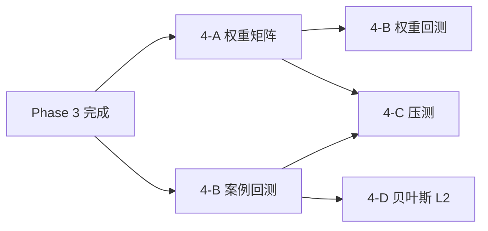

# 09 Phase 4 算法增强与规模验证计划

> **前置：** Phase 3 里程碑已通过（`docs/PHASE3_ACCEPTANCE.md`）  
> **评审：** 开工前完成 `docs/PHASE4_KICKOFF_AGENDA.md` 表决  
> **边界：** `docs/MVP_SCOPE.md` §2、`AGENTS.md` §5、技术文档 V1.7 §7.5 / §18

---

## 1. 目标

在 Phase 1–3 已交付的画像、规则、Agent、四库能力之上：

1. 引入**项目类型差异化权重**与**动态修正系数**，提升画像可解释性与可校准性；
2. 扩充事故案例库并建立**回测评测**流水线，为 L2/L3 贝叶斯冷启动做准备；
3. 建立**多项目规模压测**基线，验证 500 / 2000 项目场景下的 API 与重算性能；
4. 对视频 AI、BIM、behavior_memory、灾备等能力**按门禁延后**，仅做占位或文档化。

**本期不做：** 贝叶斯 L3 全量参数学习（除非案例 >200 且评审批准）、生产 K8s 灾备实操、自动处罚/清退。

---

## 2. 子阶段总览

| 子阶段 | 模块 | 关键交付 | 外部依赖 |
|:---:|---|---|---|
| 4-A | 权重与因子 | 类型矩阵 + DF-* + 版本回滚 | 无 |
| 4-B | 案例与回测 | 案例 ≥50 + backtest 报告 | 案例录入/导入 |
| 4-C | 性能压测 | 合成灌数 + P95 报告 | 独立压测环境 |
| 4-D | 贝叶斯 L2 | 专家先验 + 校准 API（可选） | 案例 ≥50 |
| 4-E | behavior_memory | 培训摘要向量（可选） | 合规签字 |
| 4-F | 视频/BIM | 事件接入占位（可选） | 边缘/BIM 源 |
| 4-G | 灾备 | RTO/RPO 目标文档 | 准生产 |

---

## 3. 4-A 项目类型权重与动态修正

### 3.1 Task 列表

| Task | 内容 | 状态 |
|---|---|:---:|
| 4-A.1 | `config/weights/project_type_matrix.yaml`（房建/市政/基建/机电安装，对齐 §7.5） | ✅ |
| 4-A.2 | `domain/risk.py` / `calculator.py` 接入类型系数（`project.project_type`） | ✅ |
| 4-A.3 | 动态修正因子表 `config/weights/dynamic_factors.yaml`（DF-SCH/DF-WEA/DF-HZD 占位） | ✅ |
| 4-A.4 | 权重版本表或 `metric_catalog` 旁路配置 + `effective_time` | ✅ |
| 4-A.5 | `POST /profile/recalculate` 回归：`tests/datasets/profile_algo_20.jsonl` 更新期望 | ✅ |
| 4-A.6 | 管理 API：`GET /config/weight-versions`（只读 MVP） | ✅ |

### 3.2 验收

- 切换 `project_type` 后同指标输入产生可预期分值差异；
- 权重配置变更可追踪版本，回滚不破坏历史画像行；
- 既有强规则触发分逻辑不变（`AGENTS.md` §5.1）。

---

## 4. 4-B 案例库与回测

### 4.1 Task 列表

| Task | 内容 | 状态 |
|---|---|:---:|
| 4-B.1 | 扩充 `seed_cases.py` 至 **≥50 条**（覆盖 6 类事故类型） | ✅ |
| 4-B.2 | 案例导入模板 CSV + `scripts/import_accident_cases.py` | ✅ |
| 4-B.3 | `services/cases/backtest.py`：规则/权重 vs 案例标签命中率 | ✅ |
| 4-B.4 | `tests/datasets/case_backtest_30.jsonl` + `test_case_backtest.py` | ✅ |
| 4-B.5 | `scripts/run_case_backtest.py` 输出 JSON 报告（coverage、hit_rate） | ✅ |
| 4-B.6 | Milvus 重 ingest 钩子（案例变更后可选触发） | ✅ |

### 4.2 数据门禁

| 级别 | 案例量 | 允许编码 |
|---|---:|---|
| L1 | < 50 | 仅扩充 + 检索，不做贝叶斯 |
| L2 | 50–200 | 4-D 专家先验 + 回测校准 |
| L3 | > 200 | 贝叶斯网络（单独评审） |

**当前基线：** 50 条（`AC-MVP-001` … `050`），覆盖 6 类核心事故类型与 4 类项目类型。

---

## 5. 4-C 性能压测

### 5.1 Task 列表

| Task | 内容 | 状态 |
|---|---|:---:|
| 4-C.1 | `scripts/seed_scale_data.py`：合成 N 项目/工人/分包商（tenant 隔离） | ✅ |
| 4-C.2 | `scripts/load_test_api.py`：驾驶舱、画像列表、工单列表 P95 | ✅ |
| 4-C.3 | 100 项目冒烟压测 + 报告 `docs/perf/baseline_100.md` | ✅ |
| 4-C.4 | **500 项目**门禁压测 + 报告 | ✅ |
| 4-C.5 | **2000 项目**目标压测（可选，W7–W8） | ✅ |
| 4-C.6 | `profile/recalculate` 批量耗时与 DB 连接池调优建议 | ✅ |

### 5.2 建议 SLA（评审可调整）

| 接口 | 500 项目 P95 | 错误率 |
|---|---:|---:|
| `GET /dashboard/overview` | < 800ms | < 0.1% |
| `GET /projects`（分页） | < 500ms | < 0.1% |
| `POST /profile/recalculate`（单租户） | < 30s | 0% |

---

## 6. 4-D 贝叶斯 L2（可选，案例 ≥50）

| Task | 内容 | 状态 |
|---|---|:---:|
| 4-D.1 | `domain/bayesian/prior.py` 专家先验节点（§18.3 子集） | ✅ |
| 4-D.2 | `POST /analysis/attribution` 只读推理 API + evidence | ✅ |
| 4-D.3 | 与三类画像字段映射（§18.4） | ✅ |
| 4-D.4 | `tests/services/test_bayesian_l2.py` | ✅ |

**禁止：** 输出作为处罚/清退唯一依据；必须 `need_human_review: true`。

---

## 7. 4-E behavior_memory（合规门禁）

| 条件 | 动作 |
|---|---|
| 无合规评审纪要 | **整包冻结** |
| 合规通过 | 仅存培训摘要文本向量，禁止原始音视频 |

---

## 8. 4-F / 4-G 延后项

| 模块 | 本期交付 | 完整实现条件 |
|---|---|---|
| 视频 AI | OpenAPI 占位 + 事件 schema | 边缘网关接入 |
| BIM | 二维热力 JSON 占位 | BIM 模型源 |
| 灾备 | `docs/ops/DR_TARGETS.md` RTO/RPO | 准生产双活 |

---

## 9. Phase 4 里程碑门禁

| # | 里程碑 | 目标 | 验证 |
|:---:|---|---|---|
| 1 | 权重差异化 | 四类项目类型可切换 | `test_profile_*` + YAML 快照 |
| 2 | 案例回测 | 脚本可跑、报告可生成 | `run_case_backtest.py` |
| 3 | 案例量 L2 | total ≥ 50 | `GET /case/list` |
| 4 | 压测 500 | P95 达标 | `load_test_api.py` 报告 |
| 5 | 质量 | pytest 全绿 + schema + build | CI 同级 ✅ |
| 6 | 贝叶斯 L2 | 可选 | 案例 ≥50 + 表决批准 |

---

## 10. 依赖关系



---

## 11. Session Prompt 模板

```markdown
# 任务
执行 IMPLEMENTATION_ROADMAP Task 【4-A.1 / 4-B.1 / …】。

# 必读（按序）
1. AGENTS.md
2. docs/PHASE4_KICKOFF_AGENDA.md（确认表决结果）
3. docs/plans/09-phase4-algorithm-and-scale.md
4. docs/MVP_SCOPE.md §3.1 画像边界
5. 技术文档 V1.7 §7.5 / §18.2

# 修改前阅读
【列出 2–5 个具体文件路径】

# 约束
- TDD；查询带 tenant_id
- 案例 < 50 时不实现贝叶斯 L2+
- behavior_memory 无合规签字不做

# 完成定义
- pytest -v 全绿（贴摘要）
- 勾选本计划对应 Task
```

---

**维护：** 评审后更新 §2 表决结果至 `IMPLEMENTATION_ROADMAP.md` Phase 4 章节。
