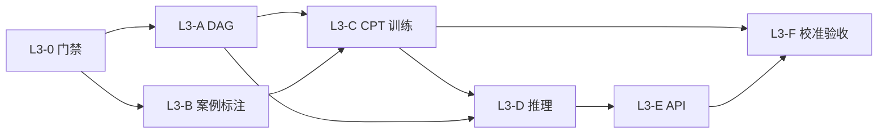

# 10 贝叶斯 L3 实施 Task 清单（基于现有代码）

> **状态：** **执行中**（Phase 5 重新立项，见 `docs/PHASE5_BAYESIAN_L3_KICKOFF.md`）  
> **前置：** L2 已交付（`domain/bayesian/`、`POST /api/v1/analysis/attribution`）  
> **门禁：** 活跃案例 ≥ **200** 条 + 单独评审表决 + 合规红线不变  
> **设计依据：** 技术文档 V1.7 §18.2–§18.4、`docs/plans/09-phase4-algorithm-and-scale.md` §4.2 L3 行

---

## 1. L2 → L3 差异（对接现有实现）

| 维度 | L2（现状） | L3（目标） |
|---|---|---|
| 代码入口 | `domain/bayesian/inference.py` `run_l2_attribution()` | 新增 `l3_inference.py`，service 层按门禁路由 |
| 概率来源 | `prior.py` 专家 `prior` + 固定 `OUTCOME_LIKELIHOOD` | 案例驱动的 **CPT**（条件概率表），专家矩阵作冷启动/平滑先验 |
| 结构 | 扁平因子加权（naive Bayes 风格） | **DAG**（人/机/料/法/环/管 → 中介 → 事故结果） |
| 观测 | `mapping.py` 画像 `dimension_scores` | 复用 `mapping.py` + 案例 `warning_indicators` 口径 |
| 训练数据 | `cases/backtest.py` 用于规则/权重回测 | 扩展为因子标签 + 结果标签训练集 |
| 门禁 | `service.py` `min_cases=50` | `min_cases=200`；不足时回退 L2 |
| API | `schemas/bayesian.py` + `endpoints/analysis.py` | 扩展响应：`propagation_paths`、`cpt_version` |
| 输出 | 因子贡献 + 事故概率 + `evidence` | 增加 **风险传播路径**、校准置信区间（可选） |

**可复用资产（勿重写）：**

```text
backend/app/domain/bayesian/prior.py      # RISK_FACTORS、ACCIDENT_OUTCOMES、OUTCOME_LIKELIHOOD、ACCIDENT_TYPE_ALIASES
backend/app/domain/bayesian/mapping.py    # 三类画像 → factor_id 证据
backend/app/domain/bayesian/inference.py
backend/app/services/bayesian/service.py
backend/app/services/cases/backtest.py    # warning_indicators_to_facts、案例行构建
backend/app/services/cases/seed_cases.py  # direct_cause / indirect_cause / tags 标注范式
backend/scripts/run_case_backtest.py      # 报告流水线模板
backend/app/api/v1/endpoints/config.py  # weight-versions 只读模式可仿照
```

---

## 2. 子阶段总览

| 子阶段 | 模块 | 关键交付 | 外部依赖 |
|:---:|---|---|---|
| L3-0 | 启动门禁 | 案例 ≥200 表决 + 数据质检脚本 | 案例录入 |
| L3-A | 网络结构 | DAG 定义 + 结构校验 | 无 |
| L3-B | 案例标注 | 因子/结果标签数据集 | 案例库扩充 |
| L3-C | 参数学习 | CPT 训练 + 版本化 | L3-B |
| L3-D | L3 推理 | 信念传播 + 传播路径 + L2 回退 | L3-A、L3-C |
| L3-E | API 契约 | 扩展 attribution + 版本查询 | L3-D |
| L3-F | 校准验收 | L3 回测报告 + pytest + 文档 | L3-C、L3-E |

---

## 3. L3-0 启动门禁

| Task | 内容 | 关键路径 | 验收 |
|---|---|---|---|
| L3-0.1 | 案例量门禁脚本：`count_active_accident_cases >= 200` 才允许 `--train` / `model_level=L3` | `backend/scripts/check_bayesian_l3_gate.py` | ✅ 本地 <200 退出码 1；≥200 退出码 0 |
| L3-0.2 | 数据质量报告：每类 `accident_type`、每类 `project_type` 覆盖度，`direct_cause`/`tags` 非空率 | `backend/scripts/report_case_coverage.py` | ✅ 输出 JSON + markdown |
| L3-0.3 | 评审纪要模板：确认 `need_human_review`、禁止自动处罚/清退（延续 `AGENTS.md` §5.4） | `docs/PHASE5_BAYESIAN_L3_KICKOFF.md` | ✅ 表决勾选存档 |

---

## 4. L3-A 网络结构（DAG）

| Task | 内容 | 关键路径 | 验收 |
|---|---|---|---|
| L3-A.1 | DAG 结构 YAML：`factor_id` 节点 + 有向边（对齐 `prior.py` 21 因子 + 7 结果） | `config/bayesian/network_structure.yaml` | ✅ 覆盖 §18.3 六类 + 结果节点 |
| L3-A.2 | 结构加载与环检测 | `backend/app/domain/bayesian/structure.py` | ✅ `test_bayesian_structure.py` 无环、未知节点拒绝 |
| L3-A.3 | CPT 槽位定义：每个节点父集 + 状态枚举（`inactive/active` 或 `unlikely/likely`） | `backend/app/domain/bayesian/cpt.py` | ✅ 与 YAML 节点一一对应 |
| L3-A.4 | 冷启动 CPT：用 L2 `OUTCOME_LIKELIHOOD` + `RISK_FACTORS.prior` 填充初始表 | `config/bayesian/cpt_prior.json` | ✅ 文件已生成；Spearman 对齐留待 L3-F |

**建议 DAG 骨架（与现有 `factor_id` 对齐）：**

```text
[画像观测] → mgmt_rectification_gap → fall_from_height
            → machine_guard_failure ↗
human_violation → env_cross_operation → struck_by_object
mgmt_schedule_pressure → … → collapse / fire / mechanical_injury
```

---

## 5. L3-B 案例 → 训练标签

| Task | 内容 | 关键路径 | 验收 |
|---|---|---|---|
| L3-B.1 | 文本标签器：`direct_cause`/`indirect_cause`/`tags` → `factor_id` 激活（关键词 + 可选 LLM 辅助**仅离线脚本**） | `backend/app/domain/bayesian/case_labels.py` | ✅ 黄金集对齐；人工 spot-check 留 Sprint 2 |
| L3-B.2 | 结果标签：`accident_type` → `outcome_id`（复用 `ACCIDENT_TYPE_ALIASES`） | 同上 | ✅ 与 `prior.py` 别名表一致 |
| L3-B.3 | 指标标签：`warning_indicators` → 因子激活（复用 `backtest` 映射表） | `case_labels.py` 调用 backtest 常量 | ✅ 与 4-B 回测口径不冲突 |
| L3-B.4 | 训练行构建：`build_l3_training_row(accident_case_library row)` | `backend/app/services/bayesian/dataset.py` | ✅ 单元测试 10 行快照 |
| L3-B.5 | 黄金集 `tests/datasets/bayesian_l3_train_50.jsonl`（**先 TDD，后扩到 200+**） | `backend/tests/services/test_bayesian_l3_labels.py` | ✅ pytest 全绿 |
| L3-B.6 | 案例扩充至 200+：扩展 `seed_cases.py` 或 CSV 导入 | `seed_cases_l3_bulk.py` | ✅ `check_bayesian_l3_gate.py` 通过 |

**训练行字段建议：**

```json
{
  "case_id": "AC-MVP-001",
  "outcome_id": "fall_from_height",
  "factor_labels": {"mgmt_rectification_gap": 1, "machine_guard_failure": 1},
  "profile_type": "project",
  "warning_indicators": [{"metric_code": "HAZARD_OVERDUE_COUNT", "value": 2}]
}
```

---

## 6. L3-C 参数学习（CPT）

| Task | 内容 | 关键路径 | 验收 |
|---|---|---|---|
| L3-C.1 | 计数器 + Laplace 平滑 MLE：`P(child|parents)` | `backend/app/services/bayesian/training.py` | 黄金 50 条可复现 CPT |
| L3-C.2 | 训练 CLI：从 DB 拉案例 → 写 CPT JSON | `backend/scripts/train_bayesian_l3.py` | `--tenant-id CSCEC` 产出 `cpt_learned.json` |
| L3-C.3 | 模型版本：`bayesian-l3-v{semver}` + `trained_at` + `case_count` | `config/bayesian/cpt_learned.json` metadata | 与 `GET /config/weight-versions` 风格一致 |
| L3-C.4 | 校准回测：holdout 因子命中率、结果 Brier 分 | `backend/app/services/bayesian/calibration.py` | 报告可生成 |
| L3-C.5 | 校准 CLI + 报告 | `backend/scripts/run_bayesian_l3_backtest.py` → `docs/algo/bayesian_l3_backtest.md` | `factor_hit_rate ≥ 0.55`（评审可调） |

**依赖建议：** `numpy` 即可；若引入 `pgmpy`，需在 `pyproject.toml` 单独 optional extra `bayesian-l3`，MVP 环境默认不装。

---

## 7. L3-D 推理引擎

| Task | 内容 | 关键路径 | 验收 |
|---|---|---|---|
| L3-D.1 | L3 推理：加载 `structure.yaml` + `cpt_learned.json`，注入 `mapping.py` 观测 | `backend/app/domain/bayesian/l3_inference.py` | 黄金案例 top-3 因子与标签有交集 |
| L3-D.2 | `run_l3_attribution()` 返回结构对齐 L2 `AttributionResult` + 扩展字段 | 同上 | `model_level=="L3"` |
| L3-D.3 | **传播路径**：DAG 上 top-k 路径（边权 = 条件概率乘积） | `l3_inference.py` `_top_propagation_paths()` | 响应含 `propagation_paths[]` |
| L3-D.4 | Service 路由：`case_count>=200` 且 CPT 存在 → L3，否则 L2 | `services/bayesian/service.py` | `test_bayesian_l3.py::test_fallback_to_l2` |
| L3-D.5 | （可选）Neo4j 邻居作补充 evidence，权重低于 CPT | 调用 `services/graph/neighbors.py` | `NEO4J_ENABLED=false` 时不影响 L3 |

**L2 保留策略：** 不删除 `inference.py`；`analyze_attribution(..., model_level="auto"|"L2"|"L3")`。

---

## 8. L3-E API 与配置

| Task | 内容 | 关键路径 | 验收 |
|---|---|---|---|
| L3-E.1 | 扩展请求：`model_level: Literal["auto","L2","L3"] = "auto"` | `schemas/bayesian.py` | OpenAPI 更新 |
| L3-E.2 | 扩展响应：`propagation_paths`、`cpt_version`、`calibration_hint` | `l3_inference.AttributionResult` | API smoke 200 |
| L3-E.3 | `GET /api/v1/config/bayesian-versions` 只读（当前 CPT 版本、case_count、trained_at） | `endpoints/config.py` 或 `endpoints/analysis.py` | 仿 `weight-versions` |
| L3-E.4 | 权限：复用 `Permission.ANALYSIS_ATTRIBUTION` | `domain/rbac.py` | 无新权限码 |
| L3-E.5 | 错误码：案例不足 200 且强制 L3 → 503；CPT 缺失 → 503 | `core/errors.py` 业务码可选 | 与 L2 门禁一致 |

**curl 示例（目标态）：**

```bash
curl -X POST http://127.0.0.1:8000/api/v1/analysis/attribution \
  -H "Content-Type: application/json" \
  -H "X-Tenant-Id: CSCEC" -H "X-Role: platform_admin" -H "X-Data-Scope: tenant" \
  -d '{"project_id":"P001","accident_type":"高处坠落","model_level":"L3"}'
```

---

## 9. L3-F 测试与验收

| Task | 内容 | 关键路径 | 验收 |
|---|---|---|---|
| L3-F.1 | 结构/标签/CPT 单元测试 | `tests/domain/test_bayesian_*.py` | 独立可跑 |
| L3-F.2 | 服务 + API 集成测试 | `tests/services/test_bayesian_l3.py` | ≥15 cases |
| L3-F.3 | 校准报告进 CI 可选 job | `.github/workflows` 或本地文档 | 文档化命令即可 |
| L3-F.4 | 更新 `docs/api/openapi.yaml`、`技术参考文档` §18 实施备注 | docs | PR 可查 |
| L3-F.5 | `docs/PHASE5_BAYESIAN_L3_ACCEPTANCE.md` 六项门禁 | docs | 对标 Phase 4 验收格式 |

---

## 10. 里程碑门禁（建议）

| # | 里程碑 | 目标 | 验证 |
|:---:|---|---|---|
| 1 | 数据 | 活跃案例 ≥200，覆盖 6 类事故 + 4 类项目 | `check_bayesian_l3_gate.py` |
| 2 | 结构 | DAG 可加载、无环 | `test_bayesian_structure.py` |
| 3 | 训练 | CPT 可复现训练 + 版本文件 | `train_bayesian_l3.py` |
| 4 | 推理 | L3 归因 API 可演示，含传播路径 | `POST /analysis/attribution?model_level=L3` |
| 5 | 校准 | 回测报告 factor_hit_rate 达标 | `run_bayesian_l3_backtest.py` |
| 6 | 质量 | pytest 全绿 + schema + build | 与 Phase 4 同级 |
| 7 | 合规 | `need_human_review: true` 全路径 | 代码审查 + 验收文档 |

---

## 11. 依赖关系



---

## 12. 实施顺序（推荐 Sprint）

| Sprint | Task 范围 | 预估 |
|:---:|---|:---:|
| S1 | L3-0 + L3-A + L3-B.1–B.5（黄金 50 条 TDD） | 1–2 周 |
| S2 | L3-B.6 案例扩至 200 + L3-C 训练/校准 | 2–3 周 |
| S3 | L3-D 推理 + L3-E API + L3-F 验收 | 1–2 周 |

**合计：** 约 4–7 周（含案例录入与评审等待）。

---

## 13. Session Prompt 模板

```markdown
# 任务
执行 docs/plans/10-bayesian-l3-implementation.md Task 【L3-A.1 / …】。

# 必读（按序）
1. docs/PROJECT_CLOSURE.md（确认已重新立项）
2. docs/plans/10-bayesian-l3-implementation.md
3. backend/app/domain/bayesian/prior.py（因子/结果 ID 口径）
4. backend/app/domain/bayesian/mapping.py（画像观测）
5. backend/app/services/cases/backtest.py（案例指标映射）

# 修改前阅读
【列出 2–5 个具体文件路径】

# 约束
- TDD；查询带 tenant_id
- 案例 < 200 时仅允许 L2 路径或训练脚本 dry-run
- 输出不得作为处罚/清退唯一依据；必须 need_human_review: true
- 不引入 Milvus/Redis 新中间件；CPT 存 JSON/YAML

# 完成定义
- pytest -v 相关模块全绿
- 勾选本计划对应 Task
- 若动 API：更新 openapi.yaml + curl 示例
```

---

## 14. 明确不做（L3 范围内）

- 贝叶斯 **L4**（时序/GNN，§18.2 L4 行）
- 在线参数学习 / 自动重训 cron（仅 CLI 手动训练）
- 将 L3 结论写入工单状态机或自动创建停工/清退单
- 向 LLM 传入案例原文中的敏感字段做实时推理（训练标注可离线）

---

**维护：** 若重新立项，将 §2 表决结果同步至新一期 `IMPLEMENTATION_ROADMAP.md`，并解除 `PROJECT_CLOSURE.md` 中的 L3 冻结说明。
