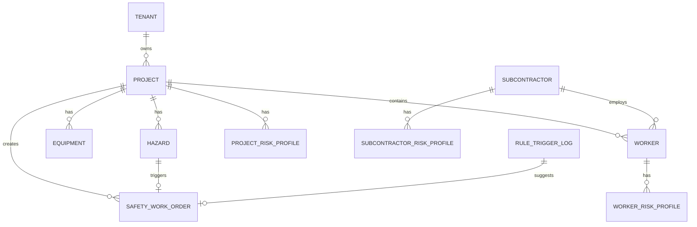

# 中建集团项目工地安全智能平台 — 数据库数据表设计文档

| 项目 | 内容 |
|---|---|
| 文档名称 | 数据库数据表设计文档 |
| 版本号 | V1.0 |
| 编制日期 | 2026-06-02 |
| 依据文档 | 《中建集团项目工地安全智能平台_技术开发文档_V1.6_记忆系统与上下文治理增强版》（V1.7） |
| 代码基线 | `backend/app/infrastructure/database/models.py` |
| 迁移版本 | Alembic `20260602_0001` |
| 数据库 | MySQL 8.0 / InnoDB / utf8mb4 |

---

## 1. 文档说明

### 1.1 编写目的

本文档对平台全部数据库表进行字段级、约束级、索引级设计说明，供研发建表、迁移、查询优化和数据治理使用。内容分为：

- **已实现（MVP）**：当前代码与 Alembic 已落地的 12 张 MySQL 表；
- **规划（二期+）**：技术文档 V1.7 定义、尚未编码的扩展表。

### 1.2 存储总体架构

```text
┌─────────────────────────────────────────────────────────────┐
│ L4 结构化事实（MySQL）← 业务判断唯一事实来源                  │
│   主数据 / 隐患 / 设备 / 画像 / 工单 / 规则日志 / Agent 审计   │
├─────────────────────────────────────────────────────────────┤
│ L3 语义向量（Milvus）← 案例库 / 知识库 / 行为摘要（二期）      │
├─────────────────────────────────────────────────────────────┤
│ L2 关系图谱（Neo4j）← 项目-分包-工人-隐患-设备关系（二期）     │
├─────────────────────────────────────────────────────────────┤
│ L1 缓存状态（Redis）← 画像缓存 / 会话记忆 / 任务状态（二期）   │
├─────────────────────────────────────────────────────────────┤
│ 时序库（InfluxDB/TDengine）← IoT 原始采样（二期）             │
└─────────────────────────────────────────────────────────────┘
```

### 1.3 命名规范

| 规范项 | 规则 |
|---|---|
| 表名 | 小写蛇形，如 `project_risk_profile` |
| 业务主键 | `{entity}_id`，如 `project_id`、`worker_id` |
| 自增主键 | `id`，INT，不参与业务逻辑 |
| 时间戳 | 所有业务表含 `created_at`、`updated_at` |
| 组织域 | 所有业务表含 `tenant_id`；主数据表额外含 `org_path` |
| JSON 字段 | 用于标签、证据、升级历史等半结构化数据 |

### 1.4 统一 ID 体系

| 对象 | 字段名 | 编码示例 | 权威来源 |
|---|---|---|---|
| 租户 | tenant_id | CSCEC-DEMO | 平台租户管理 |
| 项目 | project_id | P001 | 集团项目主数据 |
| 分包商 | subcontractor_id | S001 | 供应商/合同系统 |
| 工人 | worker_id | W001 | 劳务实名制平台 |
| 隐患 | hazard_id | H001 | 隐患管理系统 |
| 设备 | equipment_id | E001 | 特种设备系统 |
| 工单 | work_order_id | WO-001 | 平台生成 |
| 规则触发 | trigger_id | RT-001 | 规则引擎 |
| Agent 任务 | task_id | UUID | Agent 编排服务 |
| 指标 | metric_code | PROJECT_HAZARD_OVERDUE_RATE | 指标语义层 |

---

## 2. 表清单总览

### 2.1 MVP 已实现表（12 张）

| 序号 | 表名 | 中文名 | 记录量级（试点） | 状态 |
|:---:|---|---|:---:|:---:|
| 1 | tenant | 租户表 | 1–10 | ✅ |
| 2 | project | 项目主数据表 | 2,000+ | ✅ |
| 3 | subcontractor | 分包商主数据表 | 5,000+ | ✅ |
| 4 | worker | 工人主数据表 | 500,000+ | ✅ |
| 5 | hazard | 隐患台账表 | 3,000,000+/年 | ✅ |
| 6 | equipment | 设备台账表 | 50,000+ | ✅ |
| 7 | project_risk_profile | 项目风险画像表 | 2,000+/日 | ✅ |
| 8 | worker_risk_profile | 工人风险画像表 | 500,000+/日 | ✅ |
| 9 | subcontractor_risk_profile | 分包商风险画像表 | 50,000+/日 | ✅ |
| 10 | rule_trigger_log | 强规则触发日志表 | 100,000+/年 | ✅ |
| 11 | safety_work_order | 安全工单表 | 500,000+/年 | ✅ |
| 12 | agent_task_log | Agent 任务审计表 | 1,000,000+/年 | ✅ 表已建，写入待接入 |

### 2.2 规划扩展表（11 张）

| 序号 | 表名 | 中文名 | 阶段 |
|:---:|---|---|---|
| 13 | master_data_mapping | 主数据映射表 | 二期 |
| 14 | metric_catalog | 指标字典表 | 二期 |
| 15 | profile_calc_trigger | 画像重算触发配置表 | 二期 |
| 16 | profile_calc_detail | 画像计算明细表 | 二期 |
| 17 | agent_session_summary | 会话摘要表 | MVP+ |
| 18 | agent_task_checkpoint | Agent 任务 Checkpoint 表 | MVP+ |
| 19 | worker_behavior_memory | 工人行为摘要记忆表 | 二期 |
| 20 | agent_prompt_version | Prompt 版本表 | 二期 |
| 21 | agent_nl2sql_audit | NL2SQL 审计表 | 二期 |
| 22 | agent_feedback | Agent 反馈表 | 二期 |
| 23 | accident_case_library | 事故案例库表 | 二期 |

---

## 3. MVP 已实现表详细设计

---

### 3.1 tenant — 租户表

**表说明：** 集团/工程局级租户根节点，所有业务数据通过 `tenant_id` 关联。

**ORM 模型：** `Tenant`  
**源文件：** `backend/app/infrastructure/database/models.py`

#### 3.1.1 字段定义

| 序号 | 字段名 | 数据类型 | 空 | 默认值 | 键 | 说明 |
|:---:|---|---|:---:|---|---|---|
| 1 | id | INT | N | AUTO_INCREMENT | PK | 自增主键 |
| 2 | tenant_id | VARCHAR(64) | N | — | UK | 租户业务编码 |
| 3 | tenant_name | VARCHAR(128) | N | — | — | 租户名称 |
| 4 | org_path | VARCHAR(512) | N | `/CSCEC` | — | 组织路径根 |
| 5 | created_at | DATETIME | N | CURRENT_TIMESTAMP | — | 创建时间 |
| 6 | updated_at | DATETIME | N | CURRENT_TIMESTAMP ON UPDATE | — | 更新时间 |

#### 3.1.2 索引

| 索引名 | 类型 | 字段 |
|---|---|---|
| PRIMARY | 主键 | id |
| uk_tenant_id / UNIQUE | 唯一 | tenant_id |
| ix_tenant_tenant_id | 普通 | tenant_id |

#### 3.1.3 建表 DDL

```sql
CREATE TABLE tenant (
    id              INT             NOT NULL AUTO_INCREMENT COMMENT '自增主键',
    tenant_id       VARCHAR(64)     NOT NULL COMMENT '租户业务编码',
    tenant_name     VARCHAR(128)    NOT NULL COMMENT '租户名称',
    org_path        VARCHAR(512)    NOT NULL DEFAULT '/CSCEC' COMMENT '组织路径根',
    created_at      DATETIME        NOT NULL DEFAULT CURRENT_TIMESTAMP COMMENT '创建时间',
    updated_at      DATETIME        NOT NULL DEFAULT CURRENT_TIMESTAMP ON UPDATE CURRENT_TIMESTAMP COMMENT '更新时间',
    PRIMARY KEY (id),
    UNIQUE KEY uk_tenant_id (tenant_id)
) ENGINE=InnoDB DEFAULT CHARSET=utf8mb4 COMMENT='租户表';
```

#### 3.1.4 演示数据

| tenant_id | tenant_name | org_path |
|---|---|---|
| CSCEC-DEMO | 中建演示租户 | /CSCEC |

---

### 3.2 project — 项目主数据表

**表说明：** 项目基础信息，画像计算、权限过滤、大屏排名的核心维度。

**ORM 模型：** `Project`

#### 3.2.1 字段定义

| 序号 | 字段名 | 数据类型 | 空 | 默认值 | 键 | 说明 |
|:---:|---|---|:---:|---|---|---|
| 1 | id | INT | N | AUTO_INCREMENT | PK | 自增主键 |
| 2 | project_id | VARCHAR(64) | N | — | UK | 集团统一项目编码 |
| 3 | tenant_id | VARCHAR(64) | N | — | IDX | 租户标识 |
| 4 | org_path | VARCHAR(512) | N | — | IDX | 组织路径 |
| 5 | project_name | VARCHAR(160) | N | — | — | 项目名称 |
| 6 | project_type | VARCHAR(64) | N | — | — | 项目类型 |
| 7 | phase | VARCHAR(64) | N | — | — | 施工阶段 |
| 8 | region | VARCHAR(64) | N | — | — | 所属区域 |
| 9 | schedule_pressure_index | FLOAT | N | 0 | — | 工期压力指数 0–100 |
| 10 | created_at | DATETIME | N | CURRENT_TIMESTAMP | — | 创建时间 |
| 11 | updated_at | DATETIME | N | CURRENT_TIMESTAMP ON UPDATE | — | 更新时间 |

#### 3.2.2 枚举值

**project_type（项目类型）：**

| 值 | 说明 |
|---|---|
| 房建 | 房屋建筑工程 |
| 市政 | 市政基础设施 |
| 基建 | 基础设施/公路/铁路 |
| 机电安装 | 机电安装工程 |

**phase（施工阶段，示例）：**

| 值 | 说明 |
|---|---|
| 深基坑 | 基坑施工阶段 |
| 主体结构 | 主体施工 |
| 装饰装修 | 装修阶段 |
| 竣工交付 | 收尾阶段 |

#### 3.2.3 索引

| 索引名 | 类型 | 字段 |
|---|---|---|
| PRIMARY | 主键 | id |
| UNIQUE | 唯一 | project_id |
| ix_project_tenant_id | 普通 | tenant_id |
| ix_project_org_path | 普通 | org_path |

#### 3.2.4 建表 DDL

```sql
CREATE TABLE project (
    id                      INT             NOT NULL AUTO_INCREMENT,
    project_id              VARCHAR(64)     NOT NULL COMMENT '集团统一项目编码',
    tenant_id               VARCHAR(64)     NOT NULL COMMENT '租户标识',
    org_path                VARCHAR(512)    NOT NULL COMMENT '组织路径',
    project_name            VARCHAR(160)    NOT NULL COMMENT '项目名称',
    project_type            VARCHAR(64)     NOT NULL COMMENT '项目类型',
    phase                   VARCHAR(64)     NOT NULL COMMENT '施工阶段',
    region                  VARCHAR(64)     NOT NULL COMMENT '所属区域',
    schedule_pressure_index FLOAT           NOT NULL DEFAULT 0 COMMENT '工期压力指数',
    created_at              DATETIME        NOT NULL DEFAULT CURRENT_TIMESTAMP,
    updated_at              DATETIME        NOT NULL DEFAULT CURRENT_TIMESTAMP ON UPDATE CURRENT_TIMESTAMP,
    PRIMARY KEY (id),
    UNIQUE KEY uk_project_id (project_id),
    KEY ix_project_tenant_id (tenant_id),
    KEY ix_project_org_path (org_path)
) ENGINE=InnoDB DEFAULT CHARSET=utf8mb4 COMMENT='项目主数据表';
```

#### 3.2.5 演示数据

| project_id | project_name | project_type | phase | schedule_pressure_index |
|---|---|---|---|---:|
| P001 | 上海临港智慧建造项目 | 房建 | 主体结构 | 18 |
| P002 | 苏州轨交配套项目 | 市政 | 深基坑 | 12 |
| P003 | 杭州未来社区项目 | 房建 | 装饰装修 | 6 |

#### 3.2.6 关联关系

- 一对多 → `hazard`（FK: project_id）
- 一对多 → `equipment`（FK: project_id）
- 逻辑关联 → `worker.project_id`
- 逻辑关联 → `project_risk_profile.project_id`
- 逻辑关联 → `safety_work_order.project_id`

---

### 3.3 subcontractor — 分包商主数据表

**表说明：** 参建分包商基础信息与历史事故信用分。

#### 3.3.1 字段定义

| 序号 | 字段名 | 数据类型 | 空 | 默认值 | 键 | 说明 |
|:---:|---|---|:---:|---|---|---|
| 1 | id | INT | N | AUTO_INCREMENT | PK | 自增主键 |
| 2 | subcontractor_id | VARCHAR(64) | N | — | UK | 分包商编码 |
| 3 | tenant_id | VARCHAR(64) | N | — | IDX | 租户标识 |
| 4 | org_path | VARCHAR(512) | N | — | IDX | 组织路径 |
| 5 | subcontractor_name | VARCHAR(160) | N | — | — | 分包商名称 |
| 6 | qualification_level | VARCHAR(64) | N | unknown | — | 资质等级 |
| 7 | incident_credit_score | FLOAT | N | 0 | — | 事故信用分 0–100 |
| 8 | created_at | DATETIME | N | CURRENT_TIMESTAMP | — | 创建时间 |
| 9 | updated_at | DATETIME | N | CURRENT_TIMESTAMP ON UPDATE | — | 更新时间 |

#### 3.3.2 建表 DDL

```sql
CREATE TABLE subcontractor (
    id                      INT             NOT NULL AUTO_INCREMENT,
    subcontractor_id        VARCHAR(64)     NOT NULL COMMENT '分包商编码',
    tenant_id               VARCHAR(64)     NOT NULL,
    org_path                VARCHAR(512)    NOT NULL,
    subcontractor_name      VARCHAR(160)    NOT NULL COMMENT '分包商名称',
    qualification_level     VARCHAR(64)     NOT NULL DEFAULT 'unknown' COMMENT '资质等级',
    incident_credit_score   FLOAT           NOT NULL DEFAULT 0 COMMENT '事故信用分',
    created_at              DATETIME        NOT NULL DEFAULT CURRENT_TIMESTAMP,
    updated_at              DATETIME        NOT NULL DEFAULT CURRENT_TIMESTAMP ON UPDATE CURRENT_TIMESTAMP,
    PRIMARY KEY (id),
    UNIQUE KEY uk_subcontractor_id (subcontractor_id),
    KEY ix_subcontractor_tenant_id (tenant_id),
    KEY ix_subcontractor_org_path (org_path)
) ENGINE=InnoDB DEFAULT CHARSET=utf8mb4 COMMENT='分包商主数据表';
```

#### 3.3.3 演示数据

| subcontractor_id | subcontractor_name | qualification_level | incident_credit_score |
|---|---|---|---:|
| S001 | 华安脚手架工程有限公司 | A级 | 8 |
| S002 | 启明星劳务有限公司 | B级 | 14 |
| S003 | 建机设备租赁有限公司 | A级 | 5 |

---

### 3.4 worker — 工人主数据表

**表说明：** 劳务实名制工人信息，支撑工人画像与分包商人员管理评价。

#### 3.4.1 字段定义

| 序号 | 字段名 | 数据类型 | 空 | 默认值 | 键 | 说明 |
|:---:|---|---|:---:|---|---|---|
| 1 | id | INT | N | AUTO_INCREMENT | PK | 自增主键 |
| 2 | worker_id | VARCHAR(64) | N | — | UK | 工人编码 |
| 3 | tenant_id | VARCHAR(64) | N | — | IDX | 租户标识 |
| 4 | org_path | VARCHAR(512) | N | — | IDX | 组织路径 |
| 5 | project_id | VARCHAR(64) | N | — | IDX | 所属项目（逻辑 FK） |
| 6 | subcontractor_id | VARCHAR(64) | N | — | IDX | 所属分包商（逻辑 FK） |
| 7 | worker_name_masked | VARCHAR(64) | N | — | — | 脱敏姓名 |
| 8 | work_type | VARCHAR(64) | N | — | — | 工种 |
| 9 | exam_score | FLOAT | N | 80 | — | 最近安全考核成绩 |
| 10 | violation_count | INT | N | 0 | — | 违规次数 |
| 11 | certificate_expire_date | DATE | Y | NULL | — | 特种作业证过期日 |
| 12 | created_at | DATETIME | N | CURRENT_TIMESTAMP | — | 创建时间 |
| 13 | updated_at | DATETIME | N | CURRENT_TIMESTAMP ON UPDATE | — | 更新时间 |

#### 3.4.2 合规约束

- **禁止存储：** 身份证号原文、体检健康明细、人脸原图；
- **脱敏规则：** 姓名仅保留首字+`*`，如 `张*`；
- **权限：** 体检/健康数据不进本表，二期单独加密表存储。

#### 3.4.3 建表 DDL

```sql
CREATE TABLE worker (
    id                      INT             NOT NULL AUTO_INCREMENT,
    worker_id               VARCHAR(64)     NOT NULL COMMENT '工人编码',
    tenant_id               VARCHAR(64)     NOT NULL,
    org_path                VARCHAR(512)    NOT NULL,
    project_id              VARCHAR(64)     NOT NULL COMMENT '所属项目',
    subcontractor_id        VARCHAR(64)     NOT NULL COMMENT '所属分包商',
    worker_name_masked      VARCHAR(64)     NOT NULL COMMENT '脱敏姓名',
    work_type               VARCHAR(64)     NOT NULL COMMENT '工种',
    exam_score              FLOAT           NOT NULL DEFAULT 80 COMMENT '安全考核成绩',
    violation_count         INT             NOT NULL DEFAULT 0 COMMENT '违规次数',
    certificate_expire_date DATE            NULL COMMENT '特种作业证过期日',
    created_at              DATETIME        NOT NULL DEFAULT CURRENT_TIMESTAMP,
    updated_at              DATETIME        NOT NULL DEFAULT CURRENT_TIMESTAMP ON UPDATE CURRENT_TIMESTAMP,
    PRIMARY KEY (id),
    UNIQUE KEY uk_worker_id (worker_id),
    KEY ix_worker_tenant_id (tenant_id),
    KEY ix_worker_org_path (org_path),
    KEY ix_worker_project_id (project_id),
    KEY ix_worker_subcontractor_id (subcontractor_id)
) ENGINE=InnoDB DEFAULT CHARSET=utf8mb4 COMMENT='工人主数据表';
```

#### 3.4.4 演示数据（节选）

| worker_id | worker_name_masked | work_type | exam_score | violation_count | certificate_expire_date |
|---|---|---|---:|---:|---|
| W001 | 张* | 架子工 | 72 | 2 | 有效 |
| W002 | 李* | 电工 | 84 | 0 | **已过期** |
| W008 | 郑* | 塔吊司机 | 80 | 0 | 10 天后过期 |

---

### 3.5 hazard — 隐患台账表

**表说明：** 隐患发现→整改→复查→销项全生命周期。

#### 3.5.1 字段定义

| 序号 | 字段名 | 数据类型 | 空 | 默认值 | 键 | 说明 |
|:---:|---|---|:---:|---|---|---|
| 1 | id | INT | N | AUTO_INCREMENT | PK | 自增主键 |
| 2 | hazard_id | VARCHAR(64) | N | — | UK | 隐患编码 |
| 3 | tenant_id | VARCHAR(64) | N | — | IDX | 租户标识 |
| 4 | org_path | VARCHAR(512) | N | — | — | 组织路径 |
| 5 | project_id | VARCHAR(64) | N | — | FK, IDX | 所属项目 |
| 6 | subcontractor_id | VARCHAR(64) | Y | NULL | IDX | 责任分包商 |
| 7 | title | VARCHAR(200) | N | — | — | 隐患标题 |
| 8 | severity | VARCHAR(32) | N | — | — | 严重程度 |
| 9 | status | VARCHAR(32) | N | — | — | 整改状态 |
| 10 | due_date | DATE | N | — | — | 整改截止日期 |
| 11 | created_at | DATETIME | N | CURRENT_TIMESTAMP | — | 创建时间 |
| 12 | updated_at | DATETIME | N | CURRENT_TIMESTAMP ON UPDATE | — | 更新时间 |

#### 3.5.2 枚举值

**severity（严重程度）：**

| 值 | 说明 | 强规则关联 |
|---|---|---|
| normal | 一般隐患 | — |
| major | 重大隐患 | SR-PROJ-001 |
| critical | 特别重大 | SR-PROJ-001 升级 |

**status（整改状态）：**

| 值 | 说明 |
|---|---|
| open | 待整改 |
| processing | 整改中 |
| reviewing | 待复查 |
| closed | 已销项 |

#### 3.5.3 建表 DDL

```sql
CREATE TABLE hazard (
    id                  INT             NOT NULL AUTO_INCREMENT,
    hazard_id           VARCHAR(64)     NOT NULL COMMENT '隐患编码',
    tenant_id           VARCHAR(64)     NOT NULL,
    org_path            VARCHAR(512)    NOT NULL,
    project_id          VARCHAR(64)     NOT NULL COMMENT '所属项目',
    subcontractor_id    VARCHAR(64)     NULL COMMENT '责任分包商',
    title               VARCHAR(200)    NOT NULL COMMENT '隐患标题',
    severity            VARCHAR(32)     NOT NULL COMMENT '严重程度',
    status              VARCHAR(32)     NOT NULL COMMENT '整改状态',
    due_date            DATE            NOT NULL COMMENT '整改截止日期',
    created_at          DATETIME        NOT NULL DEFAULT CURRENT_TIMESTAMP,
    updated_at          DATETIME        NOT NULL DEFAULT CURRENT_TIMESTAMP ON UPDATE CURRENT_TIMESTAMP,
    PRIMARY KEY (id),
    UNIQUE KEY uk_hazard_id (hazard_id),
    KEY ix_hazard_tenant_id (tenant_id),
    KEY ix_hazard_project_id (project_id),
    KEY ix_hazard_subcontractor_id (subcontractor_id),
    CONSTRAINT fk_hazard_project FOREIGN KEY (project_id) REFERENCES project (project_id)
) ENGINE=InnoDB DEFAULT CHARSET=utf8mb4 COMMENT='隐患台账表';
```

#### 3.5.4 演示数据

| hazard_id | project_id | title | severity | status | due_date |
|---|---|---|---|---|---|
| H001 | P001 | 外脚手架连墙件缺失 | major | open | 已超期 2 天 |
| H002 | P001 | 临边防护不到位 | normal | processing | 明天到期 |
| H003 | P002 | 基坑临边警示不足 | normal | open | 已超期 1 天 |
| H004 | P003 | 材料堆放占用通道 | normal | closed | 已闭环 |

---

### 3.6 equipment — 设备台账表

**表说明：** 特种设备检验与使用状态，支撑设备强规则 SR-PROJ-004。

#### 3.6.1 字段定义

| 序号 | 字段名 | 数据类型 | 空 | 默认值 | 键 | 说明 |
|:---:|---|---|:---:|---|---|---|
| 1 | id | INT | N | AUTO_INCREMENT | PK | 自增主键 |
| 2 | equipment_id | VARCHAR(64) | N | — | UK | 设备编码 |
| 3 | tenant_id | VARCHAR(64) | N | — | IDX | 租户标识 |
| 4 | org_path | VARCHAR(512) | N | — | — | 组织路径 |
| 5 | project_id | VARCHAR(64) | N | — | FK, IDX | 所属项目 |
| 6 | equipment_name | VARCHAR(128) | N | — | — | 设备名称 |
| 7 | equipment_type | VARCHAR(64) | N | — | — | 设备类型 |
| 8 | inspection_expire_date | DATE | N | — | — | 检验到期日 |
| 9 | status | VARCHAR(32) | N | in_use | — | 使用状态 |
| 10 | created_at | DATETIME | N | CURRENT_TIMESTAMP | — | 创建时间 |
| 11 | updated_at | DATETIME | N | CURRENT_TIMESTAMP ON UPDATE | — | 更新时间 |

#### 3.6.2 枚举值

**equipment_type：** 塔吊、升降机、吊篮、物料提升机、施工电梯

**status：**

| 值 | 说明 |
|---|---|
| in_use | 在用（参与超期检测） |
| idle | 闲置 |
| stopped | 停用 |
| scrapped | 报废 |

#### 3.6.3 建表 DDL

```sql
CREATE TABLE equipment (
    id                      INT             NOT NULL AUTO_INCREMENT,
    equipment_id            VARCHAR(64)     NOT NULL,
    tenant_id               VARCHAR(64)     NOT NULL,
    org_path                VARCHAR(512)    NOT NULL,
    project_id              VARCHAR(64)     NOT NULL,
    equipment_name          VARCHAR(128)    NOT NULL,
    equipment_type          VARCHAR(64)     NOT NULL,
    inspection_expire_date  DATE            NOT NULL COMMENT '检验到期日',
    status                  VARCHAR(32)     NOT NULL DEFAULT 'in_use',
    created_at              DATETIME        NOT NULL DEFAULT CURRENT_TIMESTAMP,
    updated_at              DATETIME        NOT NULL DEFAULT CURRENT_TIMESTAMP ON UPDATE CURRENT_TIMESTAMP,
    PRIMARY KEY (id),
    UNIQUE KEY uk_equipment_id (equipment_id),
    KEY ix_equipment_tenant_id (tenant_id),
    KEY ix_equipment_project_id (project_id),
    CONSTRAINT fk_equipment_project FOREIGN KEY (project_id) REFERENCES project (project_id)
) ENGINE=InnoDB DEFAULT CHARSET=utf8mb4 COMMENT='设备台账表';
```

---

### 3.7 project_risk_profile — 项目风险画像表

**表说明：** 项目安全风险画像计算结果，支撑大屏、排名、Agent 解释。

#### 3.7.1 字段定义

| 序号 | 字段名 | 数据类型 | 空 | 默认值 | 键 | 说明 |
|:---:|---|---|:---:|---|---|---|
| 1 | id | INT | N | AUTO_INCREMENT | PK | 自增主键 |
| 2 | tenant_id | VARCHAR(64) | N | — | IDX | 租户标识 |
| 3 | project_id | VARCHAR(64) | N | — | IDX | 项目编码 |
| 4 | total_risk_score | FLOAT | N | — | — | 最终风险分 0–100 |
| 5 | risk_level | VARCHAR(20) | N | — | IDX | 风险等级 |
| 6 | risk_tags | JSON | N | [] | — | 风险标签数组 |
| 7 | evidence | JSON | N | [] | — | 证据引用数组 |
| 8 | data_completeness | FLOAT | N | 0 | — | 数据完整度 0–1 |
| 9 | human_review_required | INT | N | 0 | — | 是否需人工复核 0/1 |
| 10 | created_at | DATETIME | N | CURRENT_TIMESTAMP | — | 创建时间 |
| 11 | updated_at | DATETIME | N | CURRENT_TIMESTAMP ON UPDATE | — | 更新时间 |

#### 3.7.2 风险等级枚举

| risk_level | 分值区间 | 颜色 | 管控动作 |
|---|---|---|---|
| low | 0–30 | 绿 | 常规管理 |
| medium | 31–60 | 黄 | 加强提醒 |
| high | 61–80 | 橙 | 重点管控、专项整改 |
| critical | 81–100 | 红 | 立即干预、督办 |

#### 3.7.3 MVP 计算逻辑

源文件：`backend/app/services/profiles/calculator.py`

```text
输入：
  hazard_overdue_count        超期未闭环隐患数
  major_hazard_overdue_count  重大隐患超期数
  equipment_overdue_count     超期未检且在用的设备数
  schedule_pressure_index     工期压力指数

计算：
  base_score = min(60, overdue×8 + equipment_overdue×10 + schedule_pressure_index)
  rule_bonus = 0
  IF major_overdue > 0: rule_bonus += 20, tag="重大隐患超期未闭环", evidence="rule:SR-PROJ-001"
  IF equipment_overdue > 0: rule_bonus += 25, tag="特种设备超期未检", evidence="rule:SR-PROJ-004"
  final_score = min(100, base_score × 1.0 + rule_bonus)
  IF rule_bonus >= 20 AND level in (low, medium): 强制升至 high
```

#### 3.7.4 JSON 字段示例

**risk_tags：**
```json
["重大隐患超期未闭环", "特种设备超期未检"]
```

**evidence：**
```json
["rule:SR-PROJ-001", "rule:SR-PROJ-004"]
```

#### 3.7.5 建表 DDL

```sql
CREATE TABLE project_risk_profile (
    id                      INT             NOT NULL AUTO_INCREMENT,
    tenant_id               VARCHAR(64)     NOT NULL,
    project_id              VARCHAR(64)     NOT NULL COMMENT '项目编码',
    total_risk_score        FLOAT           NOT NULL COMMENT '最终风险分',
    risk_level              VARCHAR(20)     NOT NULL COMMENT '风险等级',
    risk_tags               JSON            NOT NULL COMMENT '风险标签',
    evidence                JSON            NOT NULL COMMENT '证据引用',
    data_completeness       FLOAT           NOT NULL DEFAULT 0 COMMENT '数据完整度',
    human_review_required   INT             NOT NULL DEFAULT 0 COMMENT '是否需人工复核',
    created_at              DATETIME        NOT NULL DEFAULT CURRENT_TIMESTAMP,
    updated_at              DATETIME        NOT NULL DEFAULT CURRENT_TIMESTAMP ON UPDATE CURRENT_TIMESTAMP,
    PRIMARY KEY (id),
    KEY ix_project_risk_profile_tenant_id (tenant_id),
    KEY ix_project_risk_profile_project_id (project_id),
    KEY ix_project_risk_profile_risk_level (risk_level)
) ENGINE=InnoDB DEFAULT CHARSET=utf8mb4 COMMENT='项目风险画像表';
```

#### 3.7.6 二期扩展字段（规划）

| 字段 | 类型 | 说明 |
|---|---|---|
| calc_date | DATE | 计算日期，支持历史快照 |
| hazard_rectification_score | DECIMAL(5,2) | 隐患整改维度分 |
| high_risk_operation_score | DECIMAL(5,2) | 高危作业维度分 |
| subcontractor_transfer_score | DECIMAL(5,2) | 分包商传导维度分 |
| equipment_mechanical_score | DECIMAL(5,2) | 设备机械维度分 |
| schedule_pressure_score | DECIMAL(5,2) | 进度压力维度分 |
| environment_monitor_score | DECIMAL(5,2) | 环境监测维度分 |
| behavior_risk_score | DECIMAL(5,2) | 现场行为维度分 |
| management_staff_score | DECIMAL(5,2) | 管理人员维度分 |
| safety_investment_score | DECIMAL(5,2) | 安全投入维度分 |
| emergency_management_score | DECIMAL(5,2) | 应急管理维度分 |
| dynamic_factor | DECIMAL(5,2) | 动态修正系数，默认 1.00 |
| strong_rule_flags | JSON | 强规则触发详情 |
| explanation | TEXT | Agent 解释 |
| suggestion | TEXT | 整改建议 |
| model_version | VARCHAR(32) | 模型版本 |

**规划唯一约束：** `UNIQUE(project_id, calc_date)`

---

### 3.8 worker_risk_profile — 工人风险画像表

#### 3.8.1 字段定义

| 序号 | 字段名 | 数据类型 | 空 | 默认值 | 键 | 说明 |
|:---:|---|---|:---:|---|---|---|
| 1 | id | INT | N | AUTO_INCREMENT | PK | 自增主键 |
| 2 | tenant_id | VARCHAR(64) | N | — | IDX | 租户标识 |
| 3 | worker_id | VARCHAR(64) | N | — | IDX | 工人编码 |
| 4 | project_id | VARCHAR(64) | N | — | — | 所属项目 |
| 5 | subcontractor_id | VARCHAR(64) | N | — | — | 所属分包商 |
| 6 | total_risk_score | FLOAT | N | — | — | 最终风险分 |
| 7 | risk_level | VARCHAR(20) | N | — | IDX | 风险等级 |
| 8 | risk_tags | JSON | N | [] | — | 风险标签 |
| 9 | evidence | JSON | N | [] | — | 证据引用 |
| 10 | data_completeness | FLOAT | N | 0 | — | 数据完整度 |
| 11 | human_review_required | INT | N | 0 | — | 是否需人工复核 |
| 12 | created_at | DATETIME | N | CURRENT_TIMESTAMP | — | 创建时间 |
| 13 | updated_at | DATETIME | N | CURRENT_TIMESTAMP ON UPDATE | — | 更新时间 |

#### 3.8.2 MVP 计算逻辑

```text
exam_risk      = max(0, 100 - exam_score) × 0.35
violation_risk = min(35, violation_count × 12)
rule_bonus     = 证书过期 ? 25 (SR-WORKER-001) : 0
final_score    = min(100, exam_risk + violation_risk + rule_bonus)
```

#### 3.8.3 建表 DDL

```sql
CREATE TABLE worker_risk_profile (
    id                      INT             NOT NULL AUTO_INCREMENT,
    tenant_id               VARCHAR(64)     NOT NULL,
    worker_id               VARCHAR(64)     NOT NULL,
    project_id              VARCHAR(64)     NOT NULL,
    subcontractor_id        VARCHAR(64)     NOT NULL,
    total_risk_score        FLOAT           NOT NULL,
    risk_level              VARCHAR(20)     NOT NULL,
    risk_tags               JSON            NOT NULL,
    evidence                JSON            NOT NULL,
    data_completeness       FLOAT           NOT NULL DEFAULT 0,
    human_review_required   INT             NOT NULL DEFAULT 0,
    created_at              DATETIME        NOT NULL DEFAULT CURRENT_TIMESTAMP,
    updated_at              DATETIME        NOT NULL DEFAULT CURRENT_TIMESTAMP ON UPDATE CURRENT_TIMESTAMP,
    PRIMARY KEY (id),
    KEY ix_worker_risk_profile_tenant_id (tenant_id),
    KEY ix_worker_risk_profile_worker_id (worker_id),
    KEY ix_worker_risk_profile_risk_level (risk_level)
) ENGINE=InnoDB DEFAULT CHARSET=utf8mb4 COMMENT='工人风险画像表';
```

---

### 3.9 subcontractor_risk_profile — 分包商风险画像表

#### 3.9.1 字段定义

| 序号 | 字段名 | 数据类型 | 空 | 默认值 | 键 | 说明 |
|:---:|---|---|:---:|---|---|---|
| 1 | id | INT | N | AUTO_INCREMENT | PK | 自增主键 |
| 2 | tenant_id | VARCHAR(64) | N | — | IDX | 租户标识 |
| 3 | subcontractor_id | VARCHAR(64) | N | — | IDX | 分包商编码 |
| 4 | project_id | VARCHAR(64) | N | — | — | 项目级画像所属项目 |
| 5 | total_risk_score | FLOAT | N | — | — | 最终风险分 |
| 6 | risk_level | VARCHAR(20) | N | — | IDX | 风险等级 |
| 7 | risk_tags | JSON | N | [] | — | 风险标签 |
| 8 | evidence | JSON | N | [] | — | 证据引用 |
| 9 | high_risk_worker_ratio | FLOAT | N | 0 | — | 高风险工人占比 |
| 10 | data_completeness | FLOAT | N | 0 | — | 数据完整度 |
| 11 | human_review_required | INT | N | 0 | — | 是否需人工复核 |
| 12 | created_at | DATETIME | N | CURRENT_TIMESTAMP | — | 创建时间 |
| 13 | updated_at | DATETIME | N | CURRENT_TIMESTAMP ON UPDATE | — | 更新时间 |

#### 3.9.2 MVP 计算逻辑

```text
base_score = min(80, overdue_hazard_count×10 + high_risk_worker_ratio×45 + incident_credit_score)
final_score = min(100, base_score)
tags: high_risk_worker_ratio >= 0.3 → "高风险工人占比较高"
      overdue_hazard_count > 0    → "隐患整改超期"
```

#### 3.9.3 建表 DDL

```sql
CREATE TABLE subcontractor_risk_profile (
    id                      INT             NOT NULL AUTO_INCREMENT,
    tenant_id               VARCHAR(64)     NOT NULL,
    subcontractor_id        VARCHAR(64)     NOT NULL,
    project_id              VARCHAR(64)     NOT NULL,
    total_risk_score        FLOAT           NOT NULL,
    risk_level              VARCHAR(20)     NOT NULL,
    risk_tags               JSON            NOT NULL,
    evidence                JSON            NOT NULL,
    high_risk_worker_ratio  FLOAT           NOT NULL DEFAULT 0 COMMENT '高风险工人占比',
    data_completeness       FLOAT           NOT NULL DEFAULT 0,
    human_review_required   INT             NOT NULL DEFAULT 0,
    created_at              DATETIME        NOT NULL DEFAULT CURRENT_TIMESTAMP,
    updated_at              DATETIME        NOT NULL DEFAULT CURRENT_TIMESTAMP ON UPDATE CURRENT_TIMESTAMP,
    PRIMARY KEY (id),
    KEY ix_subcontractor_risk_profile_tenant_id (tenant_id),
    KEY ix_subcontractor_risk_profile_subcontractor_id (subcontractor_id),
    KEY ix_subcontractor_risk_profile_risk_level (risk_level)
) ENGINE=InnoDB DEFAULT CHARSET=utf8mb4 COMMENT='分包商风险画像表';
```

---

### 3.10 rule_trigger_log — 强规则触发日志表

#### 3.10.1 字段定义

| 序号 | 字段名 | 数据类型 | 空 | 默认值 | 键 | 说明 |
|:---:|---|---|:---:|---|---|---|
| 1 | id | INT | N | AUTO_INCREMENT | PK | 自增主键 |
| 2 | trigger_id | VARCHAR(64) | N | — | UK | 触发记录编码 |
| 3 | tenant_id | VARCHAR(64) | N | — | IDX | 租户标识 |
| 4 | project_id | VARCHAR(64) | Y | NULL | IDX | 关联项目 |
| 5 | object_type | VARCHAR(32) | N | — | — | 对象类型 |
| 6 | object_id | VARCHAR(64) | N | — | — | 对象 ID |
| 7 | rule_id | VARCHAR(64) | N | — | IDX | 规则编码 |
| 8 | rule_name | VARCHAR(128) | N | — | — | 规则名称 |
| 9 | severity | VARCHAR(32) | N | — | — | 严重等级 |
| 10 | evidence | JSON | N | {} | — | 触发证据 |
| 11 | work_order_suggested | INT | N | 1 | — | 是否建议生成工单 |
| 12 | created_at | DATETIME | N | CURRENT_TIMESTAMP | — | 创建时间 |
| 13 | updated_at | DATETIME | N | CURRENT_TIMESTAMP ON UPDATE | — | 更新时间 |

#### 3.10.2 MVP 已配置强规则

| rule_id | 规则名称 | 对象 | 触发条件 | 加分 | 建议动作 |
|---|---|---|---|---:|---|
| SR-PROJ-001 | 重大隐患超期未闭环 | project | major_hazard_overdue > 0 | +20 | 生成督办工单 |
| SR-PROJ-004 | 特种设备超期未检仍使用 | project | equipment_overdue_in_use > 0 | +25 | 停用设备、核查工单 |
| SR-WORKER-001 | 特种作业证过期或无证 | worker | cert expired | +25 | 禁止特种作业 |

#### 3.10.3 建表 DDL

```sql
CREATE TABLE rule_trigger_log (
    id                      INT             NOT NULL AUTO_INCREMENT,
    trigger_id              VARCHAR(64)     NOT NULL,
    tenant_id               VARCHAR(64)     NOT NULL,
    project_id              VARCHAR(64)     NULL,
    object_type             VARCHAR(32)     NOT NULL COMMENT 'project/worker/subcontractor/equipment',
    object_id               VARCHAR(64)     NOT NULL,
    rule_id                 VARCHAR(64)     NOT NULL,
    rule_name               VARCHAR(128)    NOT NULL,
    severity                VARCHAR(32)     NOT NULL,
    evidence                JSON            NOT NULL,
    work_order_suggested    INT             NOT NULL DEFAULT 1,
    created_at              DATETIME        NOT NULL DEFAULT CURRENT_TIMESTAMP,
    updated_at              DATETIME        NOT NULL DEFAULT CURRENT_TIMESTAMP ON UPDATE CURRENT_TIMESTAMP,
    PRIMARY KEY (id),
    UNIQUE KEY uk_trigger_id (trigger_id),
    KEY ix_rule_trigger_log_tenant_id (tenant_id),
    KEY ix_rule_trigger_log_project_id (project_id),
    KEY ix_rule_trigger_log_rule_id (rule_id)
) ENGINE=InnoDB DEFAULT CHARSET=utf8mb4 COMMENT='强规则触发日志表';
```

---

### 3.11 safety_work_order — 安全工单表

#### 3.11.1 字段定义

| 序号 | 字段名 | 数据类型 | 空 | 默认值 | 键 | 说明 |
|:---:|---|---|:---:|---|---|---|
| 1 | id | INT | N | AUTO_INCREMENT | PK | 自增主键 |
| 2 | work_order_id | VARCHAR(64) | N | — | UK | 工单编码 |
| 3 | tenant_id | VARCHAR(64) | N | — | IDX | 租户标识 |
| 4 | project_id | VARCHAR(64) | N | — | IDX | 所属项目 |
| 5 | title | VARCHAR(200) | N | — | — | 工单标题 |
| 6 | work_order_type | VARCHAR(64) | N | — | — | 工单类型 |
| 7 | status | VARCHAR(32) | N | — | IDX | 工单状态 |
| 8 | risk_source_type | VARCHAR(64) | N | — | — | 风险来源类型 |
| 9 | risk_source_id | VARCHAR(64) | N | — | — | 风险来源 ID |
| 10 | assignee | VARCHAR(64) | N | 项目安全员 | — | 执行责任人 |
| 11 | due_date | DATE | N | — | — | 整改截止日期 |
| 12 | evidence | JSON | N | {} | — | 触发依据 |
| 13 | description | TEXT | N | '' | — | 工单描述 |
| 14 | created_at | DATETIME | N | CURRENT_TIMESTAMP | — | 创建时间 |
| 15 | updated_at | DATETIME | N | CURRENT_TIMESTAMP ON UPDATE | — | 更新时间 |

#### 3.11.2 工单类型枚举

| work_order_type | 中文 | 触发来源 |
|---|---|---|
| rectification_supervision | 隐患整改督办 | 隐患/强规则 |
| risk_warning | 风险预警督办 | 画像/预警 Agent |
| training_retraining | 培训复训 | 工人画像 |
| subcontractor_interview | 分包商约谈 | 分包商画像 |
| operation_restriction | 作业限制 | 证书/体检/强规则 |
| equipment_inspection | 设备核查 | 设备强规则 |
| emergency_rectification | 应急整改 | 应急管理 |

#### 3.11.3 工单状态机

源文件：`backend/app/domain/work_orders.py`

```text
                    confirm
pending_confirm ──────────────> dispatched
                                    │ accept
                                    v
                               processing ──── timeout ────> overdue_escalated
                                    │
                              submit_result
                                    v
                              waiting_review
                               │           │
                        review_pass   review_reject
                               │           │
                               v           v
                            closed     processing
```

| 当前状态 | action | 目标状态 |
|---|---|---|
| pending_confirm | confirm | dispatched |
| dispatched | accept | processing |
| processing | submit_result | waiting_review |
| waiting_review | review_pass | closed |
| waiting_review | review_reject | processing |
| processing | timeout | overdue_escalated |

#### 3.11.4 超时升级规则（规划）

| 等级 | 条件 | 升级对象 |
|---|---|---|
| 一级 | 超期 1 天 | 项目安全员、分包负责人 |
| 二级 | 超期 3 天 | 项目经理、区域安全负责人 |
| 三级 | 重大隐患超期或超 7 天 | 集团/工程局安全监管部门 |

#### 3.11.5 建表 DDL

```sql
CREATE TABLE safety_work_order (
    id                  INT             NOT NULL AUTO_INCREMENT,
    work_order_id       VARCHAR(64)     NOT NULL COMMENT '工单编码',
    tenant_id           VARCHAR(64)     NOT NULL,
    project_id          VARCHAR(64)     NOT NULL,
    title               VARCHAR(200)    NOT NULL,
    work_order_type     VARCHAR(64)     NOT NULL COMMENT '工单类型',
    status              VARCHAR(32)     NOT NULL COMMENT '工单状态',
    risk_source_type    VARCHAR(64)     NOT NULL COMMENT '风险来源类型',
    risk_source_id      VARCHAR(64)     NOT NULL COMMENT '风险来源ID',
    assignee            VARCHAR(64)     NOT NULL DEFAULT '项目安全员',
    due_date            DATE            NOT NULL COMMENT '整改截止日期',
    evidence            JSON            NOT NULL COMMENT '触发依据',
    description         TEXT            NOT NULL COMMENT '工单描述',
    created_at          DATETIME        NOT NULL DEFAULT CURRENT_TIMESTAMP,
    updated_at          DATETIME        NOT NULL DEFAULT CURRENT_TIMESTAMP ON UPDATE CURRENT_TIMESTAMP,
    PRIMARY KEY (id),
    UNIQUE KEY uk_work_order_id (work_order_id),
    KEY ix_safety_work_order_tenant_id (tenant_id),
    KEY ix_safety_work_order_project_id (project_id),
    KEY ix_safety_work_order_status (status)
) ENGINE=InnoDB DEFAULT CHARSET=utf8mb4 COMMENT='安全工单表';
```

#### 3.11.6 二期扩展字段（规划）

| 字段 | 类型 | 说明 |
|---|---|---|
| org_path | VARCHAR(512) | 组织域 |
| subcontractor_id | VARCHAR(64) | 责任分包商 |
| worker_id | VARCHAR(64) | 关联工人 |
| equipment_id | VARCHAR(64) | 关联设备 |
| priority | VARCHAR(32) | 优先级 |
| responsible_user_id | VARCHAR(64) | 责任人 ID |
| review_user_id | VARCHAR(64) | 复查人 ID |
| review_time | DATETIME | 复查时间 |
| close_time | DATETIME | 闭环时间 |
| escalation_level | INT | 升级等级 |
| escalation_history | JSON | 升级历史 |
| reject_reason | TEXT | 驳回原因 |
| attachments | JSON | 附件元数据 |
| rule_id | VARCHAR(64) | 触发规则 |
| model_version | VARCHAR(32) | 模型版本 |
| prompt_version | VARCHAR(64) | Prompt 版本 |
| agent_task_id | VARCHAR(64) | Agent 任务 ID |
| external_system | VARCHAR(64) | 外部系统 |
| external_work_order_id | VARCHAR(128) | 外部工单 ID |

---

### 3.12 agent_task_log — Agent 任务审计日志表

**状态：** 表已迁移，服务层尚未写入。

#### 3.12.1 字段定义

| 序号 | 字段名 | 数据类型 | 空 | 默认值 | 键 | 说明 |
|:---:|---|---|:---:|---|---|---|
| 1 | id | INT | N | AUTO_INCREMENT | PK | 自增主键 |
| 2 | task_id | VARCHAR(64) | N | — | UK | 任务编码 |
| 3 | tenant_id | VARCHAR(64) | N | — | IDX | 租户标识 |
| 4 | user_id | VARCHAR(64) | N | demo-user | — | 发起用户 |
| 5 | task_type | VARCHAR(64) | N | — | — | 任务类型 |
| 6 | model_name | VARCHAR(64) | N | — | — | 模型名称 |
| 7 | prompt_version | VARCHAR(64) | N | safety_assistant_v1 | — | Prompt 版本 |
| 8 | input_summary | TEXT | N | — | — | 输入摘要 |
| 9 | output_summary | TEXT | N | — | — | 输出摘要 |
| 10 | evidence | JSON | N | {} | — | 证据引用 |
| 11 | created_at | DATETIME | N | CURRENT_TIMESTAMP | — | 创建时间 |
| 12 | updated_at | DATETIME | N | CURRENT_TIMESTAMP ON UPDATE | — | 更新时间 |

#### 3.12.2 建表 DDL

```sql
CREATE TABLE agent_task_log (
    id              INT             NOT NULL AUTO_INCREMENT,
    task_id         VARCHAR(64)     NOT NULL,
    tenant_id       VARCHAR(64)     NOT NULL,
    user_id         VARCHAR(64)     NOT NULL DEFAULT 'demo-user',
    task_type       VARCHAR(64)     NOT NULL,
    model_name      VARCHAR(64)     NOT NULL,
    prompt_version  VARCHAR(64)     NOT NULL DEFAULT 'safety_assistant_v1',
    input_summary   TEXT            NOT NULL,
    output_summary  TEXT            NOT NULL,
    evidence        JSON            NOT NULL,
    created_at      DATETIME        NOT NULL DEFAULT CURRENT_TIMESTAMP,
    updated_at      DATETIME        NOT NULL DEFAULT CURRENT_TIMESTAMP ON UPDATE CURRENT_TIMESTAMP,
    PRIMARY KEY (id),
    UNIQUE KEY uk_task_id (task_id),
    KEY ix_agent_task_log_tenant_id (tenant_id)
) ENGINE=InnoDB DEFAULT CHARSET=utf8mb4 COMMENT='Agent任务审计日志表';
```

---

## 4. 规划扩展表详细设计

---

### 4.1 master_data_mapping — 主数据映射表

```sql
CREATE TABLE master_data_mapping (
    id                  BIGINT          NOT NULL AUTO_INCREMENT,
    object_type         VARCHAR(64)     NOT NULL COMMENT 'project/subcontractor/worker/equipment/hazard',
    global_id           VARCHAR(128)    NOT NULL COMMENT '平台全局ID',
    source_system       VARCHAR(64)     NOT NULL COMMENT '来源系统编码',
    source_id           VARCHAR(128)    NOT NULL COMMENT '来源系统ID',
    source_name         VARCHAR(255)    NULL,
    match_status        VARCHAR(32)     NOT NULL DEFAULT 'matched',
    confidence_score    DECIMAL(5,2)    NULL,
    manual_confirmed    BOOLEAN         NOT NULL DEFAULT FALSE,
    created_at          DATETIME        NOT NULL DEFAULT CURRENT_TIMESTAMP,
    updated_at          DATETIME        NOT NULL DEFAULT CURRENT_TIMESTAMP ON UPDATE CURRENT_TIMESTAMP,
    PRIMARY KEY (id),
    UNIQUE KEY uk_source (object_type, source_system, source_id),
    KEY idx_global (object_type, global_id)
) ENGINE=InnoDB DEFAULT CHARSET=utf8mb4 COMMENT='主数据映射表';
```

---

### 4.2 metric_catalog — 指标字典表

```sql
CREATE TABLE metric_catalog (
    id                      BIGINT          NOT NULL AUTO_INCREMENT,
    metric_code             VARCHAR(128)    NOT NULL COMMENT '指标编码',
    metric_name             VARCHAR(255)    NOT NULL COMMENT '指标名称',
    business_definition     TEXT            NOT NULL COMMENT '业务口径',
    calculation_formula     TEXT            NULL COMMENT '计算公式',
    statistical_period      VARCHAR(64)     NULL COMMENT '统计周期',
    dimensions              JSON            NULL COMMENT '可用维度',
    source_tables           JSON            NULL COMMENT '数据源表',
    source_fields           JSON            NULL COMMENT '数据源字段',
    filters                 JSON            NULL COMMENT '默认过滤',
    permission_level        VARCHAR(64)     NULL COMMENT '权限等级',
    owner_department        VARCHAR(128)    NULL COMMENT '责任部门',
    metric_version          VARCHAR(32)     NOT NULL DEFAULT 'v1.0',
    status                  VARCHAR(32)     NOT NULL DEFAULT 'enabled',
    created_at              DATETIME        NOT NULL DEFAULT CURRENT_TIMESTAMP,
    updated_at              DATETIME        NOT NULL DEFAULT CURRENT_TIMESTAMP ON UPDATE CURRENT_TIMESTAMP,
    PRIMARY KEY (id),
    UNIQUE KEY uk_metric_code (metric_code)
) ENGINE=InnoDB DEFAULT CHARSET=utf8mb4 COMMENT='指标字典表';
```

**核心指标样例：**

| metric_code | metric_name | 公式 |
|---|---|---|
| PROJECT_RISK_SCORE | 项目风险分 | base × dynamic_factor + rule_bonus |
| PROJECT_HAZARD_OVERDUE_RATE | 隐患整改超期率 | overdue / required_rectification |
| WORKER_HIGH_RISK_RATIO | 高风险工人占比 | high_risk_workers / total_workers |
| SUB_OVERDUE_RECT_RATE | 分包商整改超期率 | sub_overdue / sub_total |
| EQUIPMENT_OVERDUE_RATE | 设备超期未检率 | overdue_equipment / total_equipment |

---

### 4.3 profile_calc_detail — 画像计算明细表

```sql
CREATE TABLE profile_calc_detail (
    id                  BIGINT          NOT NULL AUTO_INCREMENT,
    calc_batch_id       VARCHAR(64)     NOT NULL COMMENT '计算批次ID',
    profile_type        VARCHAR(32)     NOT NULL COMMENT 'project/worker/subcontractor',
    object_id           VARCHAR(64)     NOT NULL,
    calc_date           DATE            NOT NULL,
    dimension_scores    JSON            NULL COMMENT '各维度得分',
    dynamic_factors     JSON            NULL COMMENT '动态修正因子',
    strong_rule_flags   JSON            NULL COMMENT '强规则触发',
    input_data_version  VARCHAR(32)     NULL,
    rule_version        VARCHAR(32)     NULL,
    model_version       VARCHAR(32)     NULL,
    elapsed_ms          INT             NULL,
    created_at          DATETIME        NOT NULL DEFAULT CURRENT_TIMESTAMP,
    PRIMARY KEY (id),
    KEY idx_batch (calc_batch_id),
    KEY idx_object (profile_type, object_id, calc_date)
) ENGINE=InnoDB DEFAULT CHARSET=utf8mb4 COMMENT='画像计算明细表';
```

---

### 4.4 agent_task_checkpoint — Agent 任务 Checkpoint 表

```sql
CREATE TABLE agent_task_checkpoint (
    id              BIGINT          NOT NULL AUTO_INCREMENT,
    task_id         VARCHAR(64)     NOT NULL,
    task_type       VARCHAR(64)     NULL,
    user_id         VARCHAR(64)     NULL,
    status          VARCHAR(32)     NULL COMMENT 'pending/running/partial_failed/done/failed',
    context_json    JSON            NULL,
    sub_task_json   JSON            NULL,
    result_ref      VARCHAR(255)    NULL,
    error_message   TEXT            NULL,
    created_at      DATETIME        NOT NULL DEFAULT CURRENT_TIMESTAMP,
    updated_at      DATETIME        NOT NULL DEFAULT CURRENT_TIMESTAMP ON UPDATE CURRENT_TIMESTAMP,
    PRIMARY KEY (id),
    UNIQUE KEY uk_task_id (task_id)
) ENGINE=InnoDB DEFAULT CHARSET=utf8mb4 COMMENT='Agent任务Checkpoint表';
```

---

### 4.5 worker_behavior_memory — 工人行为摘要记忆表

```sql
CREATE TABLE worker_behavior_memory (
    id                  BIGINT          NOT NULL AUTO_INCREMENT,
    memory_id           VARCHAR(64)     NOT NULL,
    worker_id           VARCHAR(64)     NOT NULL,
    project_id          VARCHAR(64)     NULL,
    subcontractor_id    VARCHAR(64)     NULL,
    memory_type         VARCHAR(64)     NULL COMMENT 'exam_wrong/violation_summary/training_gap',
    summary             VARCHAR(500)    NULL,
    source_ids          JSON            NULL,
    source_type         VARCHAR(64)     NULL,
    status              VARCHAR(32)     NOT NULL DEFAULT 'valid',
    valid_until         DATE            NULL,
    created_at          DATETIME        NOT NULL DEFAULT CURRENT_TIMESTAMP,
    updated_at          DATETIME        NOT NULL DEFAULT CURRENT_TIMESTAMP ON UPDATE CURRENT_TIMESTAMP,
    PRIMARY KEY (id),
    UNIQUE KEY uk_memory_id (memory_id),
    KEY idx_worker_type (worker_id, memory_type),
    KEY idx_status_valid (status, valid_until)
) ENGINE=InnoDB DEFAULT CHARSET=utf8mb4 COMMENT='工人行为摘要记忆表';
```

---

### 4.6 agent_nl2sql_audit — NL2SQL 审计表

```sql
CREATE TABLE agent_nl2sql_audit (
    id                  BIGINT          NOT NULL AUTO_INCREMENT,
    task_id             VARCHAR(64)     NOT NULL,
    user_id             VARCHAR(64)     NOT NULL,
    tenant_id           VARCHAR(64)     NULL,
    org_path            VARCHAR(512)    NULL,
    question            TEXT            NOT NULL,
    metric_candidates   JSON            NULL,
    generated_sql       TEXT            NULL,
    validated_sql       TEXT            NULL,
    validation_status   VARCHAR(32)     NOT NULL,
    reject_reason       TEXT            NULL,
    row_count           INT             NULL,
    elapsed_ms          INT             NULL,
    model_version       VARCHAR(64)     NULL,
    prompt_version      VARCHAR(64)     NULL,
    created_at          DATETIME        NOT NULL DEFAULT CURRENT_TIMESTAMP,
    PRIMARY KEY (id),
    KEY idx_task (task_id),
    KEY idx_user_time (user_id, created_at)
) ENGINE=InnoDB DEFAULT CHARSET=utf8mb4 COMMENT='NL2SQL审计表';
```

---

### 4.7 accident_case_library — 事故案例库表

```sql
CREATE TABLE accident_case_library (
    id                          BIGINT          NOT NULL AUTO_INCREMENT,
    accident_case_id            VARCHAR(64)     NOT NULL,
    tenant_id                   VARCHAR(64)     NOT NULL,
    accident_type               VARCHAR(64)     NOT NULL COMMENT '高处坠落/物体打击/触电等',
    severity                    VARCHAR(32)     NOT NULL COMMENT '近失/险情/一般事故/较大/重大',
    project_type                VARCHAR(64)     NULL,
    operation_scene             VARCHAR(64)     NULL,
    direct_cause                TEXT            NULL,
    indirect_cause              TEXT            NULL,
    involved_subjects           JSON            NULL,
    warning_indicators          JSON            NULL,
    rectification_measures      TEXT            NULL,
    tags                        JSON            NULL,
    embedding_version           VARCHAR(32)     NULL,
    status                      VARCHAR(32)     NOT NULL DEFAULT 'active',
    created_at                  DATETIME        NOT NULL DEFAULT CURRENT_TIMESTAMP,
    updated_at                  DATETIME        NOT NULL DEFAULT CURRENT_TIMESTAMP ON UPDATE CURRENT_TIMESTAMP,
    PRIMARY KEY (id),
    UNIQUE KEY uk_accident_case_id (accident_case_id)
) ENGINE=InnoDB DEFAULT CHARSET=utf8mb4 COMMENT='事故案例库表';
```

---

## 5. 实体关系与数据流

### 5.1 ER 关系图



### 5.2 画像计算数据流

```text
hazard + equipment + project.schedule_pressure_index
  ↓ calculate_project_profile()
project_risk_profile

worker.exam_score + violation_count + certificate_expire_date
  ↓ calculate_worker_profile()
worker_risk_profile

subcontractor.incident_credit_score + worker high_risk_ratio + hazard overdue
  ↓ calculate_subcontractor_profile()
subcontractor_risk_profile
```

### 5.3 外键与逻辑关联

| 关系 | 类型 | 说明 |
|---|---|---|
| hazard.project_id → project.project_id | DB FK | 唯一强制外键 |
| equipment.project_id → project.project_id | DB FK | 唯一强制外键 |
| worker.project_id → project.project_id | 逻辑 | 应用层保证 |
| *_risk_profile.*_id → 主数据 | 逻辑 | 应用层保证 |
| safety_work_order.risk_source_id | 多态 | type + id 组合引用 |

---

## 6. 索引与性能

### 6.1 推荐复合索引（二期）

| 表 | 索引 | 用途 |
|---|---|---|
| project_risk_profile | (tenant_id, risk_level, total_risk_score DESC) | 排名查询 |
| worker_risk_profile | (project_id, risk_level) | 项目内高风险工人 |
| safety_work_order | (tenant_id, project_id, status) | 项目工单列表 |
| hazard | (project_id, status, due_date) | 超期隐患统计 |
| rule_trigger_log | (tenant_id, created_at DESC) | 最近触发 |

### 6.2 容量估算

| 对象 | 规模 | 存储估算 |
|---|---:|---|
| 项目 | 2,000+ | < 10 MB |
| 工人 | 500,000+ | ~500 MB |
| 隐患/年 | 3,000,000+ | ~3 GB/年 |
| 画像/日 | 500,000+ | ~200 MB/日 |

---

## 7. 多租户与权限

### 7.1 组织域示例

```text
/CSCEC
└── /CSCEC/一局
    └── /CSCEC/一局/华东公司
        ├── /CSCEC/一局/华东公司/P001
        └── /CSCEC/一局/华东公司/P002
```

### 7.2 行级过滤 SQL 模板

```sql
-- 项目经理
WHERE tenant_id = :tenant_id AND project_id IN (:authorized_project_ids)

-- 区域管理人员
WHERE tenant_id = :tenant_id AND org_path LIKE CONCAT(:org_path, '%')

-- 分包商负责人
WHERE tenant_id = :tenant_id
  AND project_id IN (:authorized_project_ids)
  AND subcontractor_id = :subcontractor_id
```

---

## 8. 迁移与运维

### 8.1 迁移命令

```bash
cd backend
alembic upgrade head          # 升级到最新
alembic downgrade -1          # 回滚一步
python scripts/seed_demo_data.py  # 写入演示数据
```

### 8.2 备份策略

| 存储 | 方案 | RPO |
|---|---|---:|
| MySQL | 日全量 + 小时增量 | ≤ 5 分钟 |
| Redis | 可重建，非事实来源 | — |
| Milvus | 元数据 + 对象存储 | ≤ 15 分钟 |

### 8.3 相关源文件

| 文件 | 路径 |
|---|---|
| ORM 模型 | `backend/app/infrastructure/database/models.py` |
| Alembic 迁移 | `backend/alembic/versions/20260602_0001_initial_schema.py` |
| 画像计算器 | `backend/app/services/profiles/calculator.py` |
| 风险域模型 | `backend/app/domain/risk.py` |
| 工单状态机 | `backend/app/domain/work_orders.py` |
| 种子数据 | `backend/scripts/seed_demo_data.py` |

---

**文档结束**
